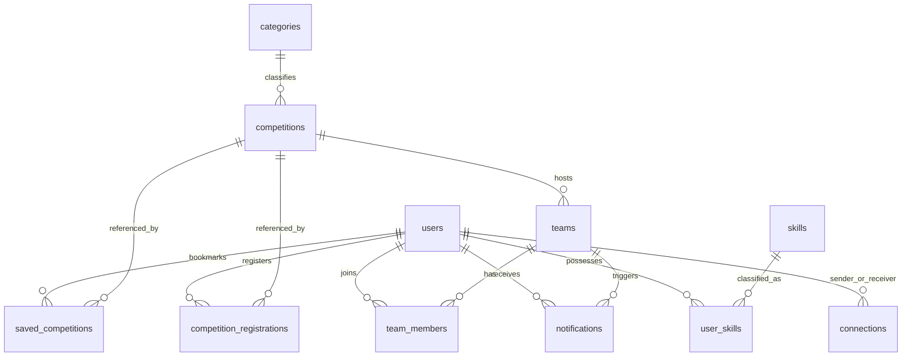
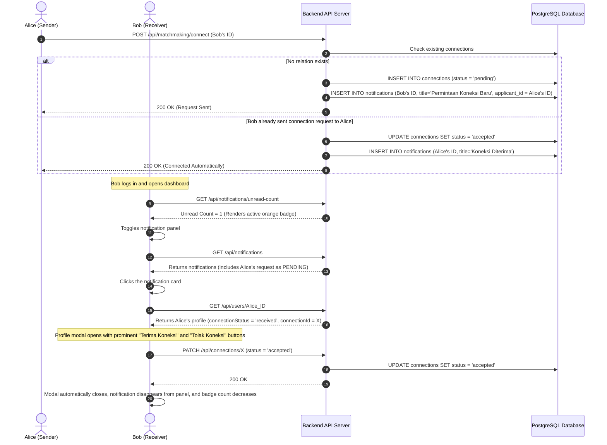

# Product Requirement Document (PRD): SideQuest

SideQuest is a comprehensive, premium co-competition and partner-matchmaking platform designed specifically for university students and event organizers. It empowers students to discover prestigious academic/non-academic competitions, establish teams with complementary skill sets, and seamlessly collaborate through an AI-powered matchmaking algorithm and an interactive AI SideKick assistant.

---

## 1. Executive Summary & Vision

University students frequently struggle to find suitable partners for hackathons, business plan competitions, UI/UX design challenges, and scientific paper contests. Existing general-purpose messaging platforms (like WhatsApp, Discord, or Telegram) lack structured profiles, portfolio verification, and contextualized team recruitment. Conversely, competition organizers (EO) lack targeted channels to promote events and manage participant registers.

SideQuest solves this by offering a centralized premium hub where:
- **Landing Page**: A LinkedIn-inspired split hero layout with a high-fidelity collaboration illustration (`assets/hero.png`), dual CTAs ("Mulai sebagai Peserta 🚀", "Daftar sebagai Penyelenggara 💼"), value propositions, and live public competition statistics.
- **Competitions** are easily searchable and filtered by categories, scope, and fees, supporting both Individual (Perorangan) and Team (Tim) registration formats.
- **Matchmaking Engine (Fase 2)** acts as an intelligent AI-powered recommendation system, calculating compatibility scores (60% to 99%) based on a multi-dimensional matrix (Skill Gaps, Cross-functional Major Synergy, University alignment) and generating personalized conversational reasoning bubbles.
- **SideKick AI Assistant (Fase 3)**: A global, persistent floating chatbot (`⚡`) that dynamically queries the database for matching competitions, teammates, or FAQs, rendering them as interactive rich cards inside a slide-out drawer.
- **Staff Governance (Moderator & Superadmin)**: Dark-glassmorphic admin portals that enable user deactivation, competition scraping from social media, feature flag toggles, and master platform maintenance controls.

---

## 2. Target Audience & User Personas

| Persona | Role | Primary Goals | Key Pain Points |
| :--- | :--- | :--- | :--- |
| **The Project Initiator (Owner)** | Student with a concrete idea/team plan | Seeks to recruit specialists (e.g., a Developer looking for a UI/UX Designer or Business Presenter). | Difficulty filtering applicants by verified skills and managing incoming application statuses. |
| **The Solo Specialist (Soloist)** | Talented student seeking a team | Wants to be discovered by active teams or find compatible peers to form a new team. | Hard to find trustworthy teams that match their skill sets and target competitions. |
| **The Competition Organizer (Organizer)** | Academic committee, student association, or external institution | Aims to easily host and publish competition listings, manage participant registrations in a structured environment, and maximize outreach to talented students. | Dispersed registration data, difficulty verifying team rosters, and lack of specialized channels to promote events to targeted student niches. |
| **The Moderator & Superadmin (Staff)** | SideQuest Platform Operators | Maintain system security, toggle platform feature modules, scrape external contests, and manage maintenance modes. | Need precise control over user bans, feature availability, and fast content importing. |

---

## 3. Core Feature Specifications

### 3.1. Authentication & Security
- **Multi-Role Registration Toggle**: The signup screen features a tabbed selector:
  - **Peserta Lomba**: Standard student inputs (University select, Study Program, Semester).
  - **Penyelenggara Lomba (Event Organizer)**: Dynamic form swap that hides student inputs and requests *"Nama Instansi Penyelenggara"*, registering users with the `organizer` role and redirecting them immediately to the EO Dashboard.
- **Forgot Password Screen**: Database-backed recovery email checks. Validated emails receive a glassmorphic green success card simulating instruction delivery; invalid emails trigger a distinct red error alert.
- **JWT-Based Security**: All API controllers verify tokens, preventing unauthorized guest access and blocking deactivated accounts (`is_active = false`) with `403 Forbidden` responses.

### 3.2. Competition Directory & Detail
- **Central Directory**: Filterable by category, scope, fees, and sorted by nearest deadline.
- **Individual vs Team Formats**: Allows organizers to enforce strict **minimum** and **maximum** member limits per team.
- **Operational Hosting Options**:
  - **Hosted (Terpadu)**: Integration where registration forms are custom-built inside SideQuest, unlocking premium dashboard analytics, automated roster checks, and exclusive co-competition student matchmaking tools.
  - **Non-Hosted (Eksternal)**: Basic informational listing where the registration CTA redirects participants to external landing pages or forms (e.g., Google Forms).

### 3.3. AI Partner Matchmaking (Fase 2)
- **Multi-Dimensional AI Scoring Engine**: Compatibility score (60% to 99%) calculated based on:
  - **Base Score**: 50 points.
  - **Skill-Gap Filling (Max +20)**: Checks candidate skills that are missing in the current user's profile.
  - **Cross-Functional Synergy (Max +15)**: Groups majors into 5 domains (Tech, Design, Business, Science, Social). Synergy pairs (e.g., Tech + Design) get +15 points; same-domain matches get +5 points.
  - **Shared Category Interests (Max +8)**: Alignment in saved/registered competition tags.
  - **University Alignment (Max +5)**: Same university bonus.
- **AI Dynamic Reasoning Generator**: Produces a personalized `aiInsight` explanation detailing the exact synergy group, reasoning, and skill-gap filling list.
- **UI Capsule Highlight**: Displays a sparkling AI tag (`✨ Sinergi`), a prominent AI disclaimer badge (`⚡ Generated by SideQuest AI`), and specific skill chips berlabel *"Mengisi Celah"* on each matchmaking profile card.

### 3.4. Team Recruitment Hub
- **Team Creation**: Owners specify description, maximum members, contact links, target competition, and required skills tags.
- **Applicant Tracking System (ATS)**: Owners can review team applicants, view their full portfolios, and click "Setuju Bergabung" (Approve) or "Tolak" (Reject) in real-time.

### 3.5. Real-Time Premium Notification Engine
- **Dynamically Calculated Badges**: Sums unread notifications, pending connection requests, and team joins.
- **Actionable Dropdown Panels**: Toggling the notification bell opens a premium panel that aggregates requests, displaying a yellow **PENDING** label for unresponded requests.
- **Profile Modal Integrations**: Clicking on a notification instantly opens the corresponding applicant's profile modal with functional action buttons at the bottom. Once accepted or rejected, the notification immediately disappears from the panel, and the badge count decreases.

### 3.6. SideKick AI Assistant & Personal Agent (Fase 3)
- **Global Dynamic Injection**: Dynamic `import('./sidekick.js')` loads the chatbot globally inside `fillSidebarUser()` for logged-in participants, ensuring zero boilerplate HTML edits.
- **Stateless Keyword Intent Engine (Backend)**: Detects user intents naturally:
  - *Competitions*: Searches `competitions` and returns a list.
  - *Teammates*: Searches `users` joined with `skills` based on skills or university keywords.
  - *FAQ Guide*: Answers platform operational questions (Matchmaking, EO fees, Tim limits).
  - *Conversational Fallback*: Welcomes users and guides them on possible prompts.
- **Persistent Obrolan Drawer (Frontend)**: Obrolan drawer slides elegantly from the right. Conversation history is saved to `localStorage` (`sq_sidekick_chat_history`) to prevent chat loss when navigating between pages.
- **Interactive Rich Cards**: If SideKick returns structured objects, the chat bubble renders interactive mini-cards (Competition details link or Teammates "Hubungkan ✨" buttons that trigger connectivity directly from the chat window).

### 3.7. Platform Governance & Moderation (Moderator & Superadmin)
- **Roster Moderation**: Toggle sliders to immediately activate or suspend users, teams, or competitions.
- **AI Web Scraper Console**: Simulates scraping external Instagram/website URLs, displaying progress logs in a retro terminal, pre-filling drafts, and saving them to the database.
- **Superadmin Controls**: Toggle moderator staff active status, turn off modules platform-wide (competitions, teams, matchmaking), and activate a master **Maintenance Mode** (blocks regular users with an golden hourglass glassmorphic landing `maintenance.html`, while staff bypasses it).

### 3.8. Sponsorship & Targeted Advertising Module (Phase 4)
- **Sponsor Invitation Flow**: Staff (Moderators/Superadmins) can invite new brand sponsors directly from the admin console. Invited sponsor accounts are immediately verified and approved for instant logging access.
- **Sponsor Portal Console (`sponsor-dashboard.html`)**: Exclusive interactive dashboard designed with vibrant glassmorphic parameters to manage brand portfolios:
  - **Overview Performance metrics**: Tracks overall daily ad spend, total active impressions, clicks, and calculated click-through rate (CTR).
  - **Ad Creator Form & Cost Simulator**: Sponsors easily configure title, target URL, banner poster, target page keys (Dashboard, Competitions, Matchmaking, Teams), and calendar ranges. Ad campaign costs are calculated instantly.
  - **Historical Date-Effective Pricing**: Ad daily pricing configurations are logged historically in `sponsorship_pricing_rates`. The system dynamically selects active rates on the campaign start date (`effective_date <= start_date`) for price transparency.
  - **Moderator Auditing Logs**: Staff can adjust campaign costs manually with a mandatory reason input, leaving an unalterable trail log in `sponsorship_cost_logs` for transparency auditing.
- **E2E Widget Targeted Ad Banner (Student-Facing)**:
  - Dynamic glassmorphic targeted banners embedded across 4 primary student pages.
  - Toggles active campaigns randomly with automated impression counting and click monitoring.
  - Reverts gracefully to a promotional card for **"Sidekick AI Assistant"** if no active campaigns are found.

---

## 4. Feature Details, Site Map & Role Access Rights

To ensure clean system governance and reliable security, all functional modules are regulated under a structured navigation hierarchy (Site Map) and a strict Role-Based Access Control (RBAC) authorization matrix.

### 4.1. Platform Site Map

Below is the structured navigation flow representing both the public-facing pages and authenticated user dashboard areas:

- **Public Space (Unauthenticated)**
  - Landing Page (`index.html`) -> Value Proposition, Live Platform Stats, Latest 5 Competitions Preview (Read-Only)
  - About Us Page (`pages/about.html`) -> Developer Team Profile & Vision
  - FAQ Page (`pages/faq.html`) -> Interactive Accordions FAQ
  - Terms of Service (`pages/terms.html`) -> Standard Usage Agreement
  - Privacy Policy (`pages/privacy.html`) -> GDPR and Data Safety Standard
  - Login Page (`pages/login.html`) -> Account Authentication Gate
  - Registration Page (`pages/register.html`) -> Signup Gateway (Student Tab vs Organizer Tab)
  - Forgot Password Gateway (`pages/forgot-password.html`) -> Recovery Instructions Form
  - Onboarding Screen (`pages/onboarding.html`) -> Verification Status & Active Sandbox Logs
- **Student Dashboard Portal (`pages/dashboard.html` & sub-sections)**
  - Home Dashboard (`dashboard.html`) -> Personal Stats, Active Joined Teams, Matchmaking Previews
  - Competitions Directory (`direktori.html`) -> Searchable Contest Grid, Categories/Fees Filters
  - Competition Detail (`detail.html?id=...`) -> Full Contest Requirements, Group Size Limits, Roster Registration
  - Matchmaking Room (`matchmaking.html`) -> AI Complementary Scoring, AI Dynamic Reasoning Insight
  - Teammate Hunt (`cari-tim.html`) -> Open Vacancy ATS, Recruitment Form, Applicant Pipeline
  - My Profile (`profil.html` & `edit-profil.html`) -> Portfolio Fields, Verified Skill Chips, Achievements Log
- **Event Organizer (EO) Dashboard (`pages/organizer-dashboard.html` & sub-sections)**
  - EO Home (`organizer-dashboard.html`) -> Active Contest Submissions list, Registered Teams KPI
  - Post Competition (`posting-lomba.html`) -> Hosted/Non-Hosted Contest Publisher with member quota limits
- **Sponsor / Brand Partner Dashboard (`pages/sponsor-dashboard.html` & sub-menu)**
  - Sponsor Console (`sponsor-dashboard.html`) -> Management of Promotional Ad Banners, Bootcamp/Development Tool Vouchers, and Tournament Sponsorship Campaigns.
- **Staff Control Console (`pages/admin-dashboard.html`)**
  - Master KPI Overview -> Platform total users metrics, database statuses, system flag toggles, active Sponsor listings
  - Roster Moderator & Users -> Users lists with slider switch to instantly ban/restore student, organizer, or sponsor accounts
  - Retro Scraper Logs Console -> AI Web scraper simulator from instagram URLs
  - System Flags & Maintenance -> Master toggles for modules and maintenance bypass mode

### 4.2. Role Access Authorization Matrix (RBAC)

The stateless JWT security engine dictates feature levels based on the user's authenticated role structure:

| Functional Module | Guest / Anonymous | Student (Peserta) | Organizer (EO) | Brand Sponsor | Staff (Moderator/Super) |
| :--- | :---: | :---: | :---: | :---: | :---: |
| **Browse Landing Page & FAQ** | **Read-Only** | **Full Access** | **Full Access** | **Full Access** | **Full Access** |
| **Browse Competition Directory**| **Read-Only** | **Full Access & Join** | **Read-Only** | **Read-Only** | **Manage & Moderate** |
| **Create & Edit Competitions**| No Access | No Access | **Full (Own Listing)** | No Access | **Full (Moderate All)** |
| **AI Partner Matchmaking** | No Access | **Full (Browse & Connect)**| No Access | No Access | No Access |
| **Create Team & Manage ATS** | No Access | **Full (Own Team)** | No Access | No Access | No Access |
| **Apply & Join Active Teams**| No Access | **Full** | No Access | No Access | No Access |
| **SideKick AI Assistant** | No Access | **Full** | No Access | No Access | No Access |
| **Edit Skills & Portfolio** | No Access | **Full** | No Access | No Access | No Access |
| **Review Competition Roster** | No Access | No Access | **Full (Own Event)** | No Access | No Access |
| **Manage Campaigns & Ads** | No Access | No Access | No Access | **Full (Own Listing)** | **Full (Moderate All)** |
| **Instagram AI Web Scraping**| No Access | No Access | No Access | No Access | **Full** |
| **Ban Account & Toggle Flags**| No Access | No Access | No Access | No Access | **Full** |
| **Toggle Staff/Moderator Ban**| No Access | No Access | No Access | No Access | **Superadmin Only** |

---

## 5. Technical Architecture & Database Schema

SideQuest is powered by a highly structured and optimized modern technology stack, seamlessly combining robust relational data management, dynamic modular frontend patterns, and deterministic AI scoring/NLP engines:

### 5.1. Core Tech Stack Detail
* **Backend Core**: Built on **Node.js** with the **Express.js** framework, serving a lightweight, high-performance RESTful API. It handles token verification, state transitions, dynamic notifications, and houses the AI personal agent endpoints.
* **Database Layer**: A relational **PostgreSQL** database managed using connection pooling (`pg` client). Relational design guarantees transactional consistency and high-speed multi-table joins (e.g., coupling students, skill sets, and matching vacancies).
* **Security & Auth**: Secured via stateless **JSON Web Tokens (JWT)**. Passwords are encrypted utilizing **Bcrypt** hashing. Middleware guards intercept every restricted endpoint, immediately blocking banned profiles (`is_active = false`) with `403 Forbidden` responses.
* **Frontend-Backend Communications**: Managed by a custom **ESM-based client API layer (`frontend/js/api.js`)**. It encapsulates all system endpoints (auth, competitions, teams, matchmaking, notifications, sidekick) into modular asynchronous methods. It integrates an automated `401 Unauthorized` interceptor that uses silent refresh tokens to re-authenticate users seamlessly.

### 5.2. Embedded AI Technologies & Engines
SideQuest features advanced, server-driven intelligence built directly into the platform without external heavy model dependencies:
* **Multi-Dimensional AI Scoring Engine**: A deterministic matchmaking algorithm designed to pair students with highly complementary co-competitors:
  - **Skill-Gap Analysis (+20 pts)**: Evaluates the initiator's desired/missing capabilities against the candidate's verified skills, highlighting exact matching chips labeled *"Mengisi Celah"*.
  - **Cross-Functional Domain Synergy (+15 pts)**: Automatically maps study programs into 5 distinct domains (Tech, Design, Business, Science, Social). It rewards cross-functional pairs (e.g., Developer + Designer) to foster holistic startup-like team formations.
  - **Interest Overlap (+8 pts) & Campus Bonus (+5 pts)**: Accounts for mutual saved contests and shared almamaters.
* **Dynamic AI Reasoning Generator**: Dynamically crafts personalized conversational insights (`aiInsight`) per candidate card, explaining exactly *why* this pairing is synergistic, which skill gaps are bridged, and how they should collaborate.
* **SideKick NLP Intent Engine**: A keyword-based natural language processing model hosted on `POST /api/sidekick/chat`. It interprets unstructured user queries (e.g., *"recommend react developers from IPB"*, *"find hackathons next month"*, or *"how does matchmaking work"*), parses targets, queries the PostgreSQL database via structured SQL searches, and compiles rich response payloads containing contextual text and interactive UI cards (Competition details or "Connect ✨" triggers).



### 5.3. Entity Specifications (schema.sql & migrations)

```sql
-- User Account Info (includes is_active toggle flag)
CREATE TABLE users (
  id SERIAL PRIMARY KEY,
  name VARCHAR(100) NOT NULL,
  email VARCHAR(100) UNIQUE NOT NULL,
  password VARCHAR(255) NOT NULL,
  university VARCHAR(100),
  prodi VARCHAR(100),
  avatar_color VARCHAR(20),
  bio TEXT,
  role VARCHAR(20) DEFAULT 'peserta',
  experience JSONB,
  achievements JSONB,
  online BOOLEAN DEFAULT false,
  is_active BOOLEAN DEFAULT true
);

-- Bidirectional Connections
CREATE TABLE connections (
  id SERIAL PRIMARY KEY,
  sender_id INT REFERENCES users(id) ON DELETE CASCADE,
  receiver_id INT REFERENCES users(id) ON DELETE CASCADE,
  status VARCHAR(20) DEFAULT 'pending' CHECK (status IN ('pending', 'accepted', 'rejected')),
  created_at TIMESTAMP DEFAULT CURRENT_TIMESTAMP,
  UNIQUE(sender_id, receiver_id)
);

-- Platform Configuration & Master settings
CREATE TABLE platform_settings (
  key VARCHAR(100) PRIMARY KEY,
  value VARCHAR(255) NOT NULL
);

-- Historical Ad Daily Pricing Rates
CREATE TABLE sponsorship_pricing_rates (
  id SERIAL PRIMARY KEY,
  page_key VARCHAR(50) NOT NULL, -- 'dashboard', 'competitions', 'matchmaking', 'teams'
  price_per_day DECIMAL(12, 2) NOT NULL,
  effective_date DATE NOT NULL,
  created_at TIMESTAMP DEFAULT CURRENT_TIMESTAMP
);

-- Sponsor Partnership Ad Campaigns
CREATE TABLE sponsorships (
  id SERIAL PRIMARY KEY,
  sponsor_id INT REFERENCES users(id) ON DELETE CASCADE,
  title VARCHAR(150) NOT NULL,
  target_url TEXT NOT NULL,
  image_url TEXT NOT NULL,
  pages VARCHAR(50)[] NOT NULL, -- Array target page keys
  start_date DATE NOT NULL,
  end_date DATE NOT NULL,
  total_cost DECIMAL(12, 2) NOT NULL,
  impressions INT DEFAULT 0,
  clicks INT DEFAULT 0,
  is_active BOOLEAN DEFAULT true,
  created_at TIMESTAMP DEFAULT CURRENT_TIMESTAMP
);

-- Moderator Cost Adjustment Audit Logs
CREATE TABLE sponsorship_cost_logs (
  id SERIAL PRIMARY KEY,
  sponsorship_id INT REFERENCES sponsorships(id) ON DELETE CASCADE,
  modified_by INT REFERENCES users(id) ON DELETE CASCADE,
  old_cost DECIMAL(12, 2) NOT NULL,
  new_cost DECIMAL(12, 2) NOT NULL,
  reason TEXT NOT NULL,
  modified_at TIMESTAMP DEFAULT CURRENT_TIMESTAMP
);
```

---

## 6. System Interaction Flows

Below is the interaction sequence showing how a connection request is initiated, processed, and accepted dynamically from the notification panel.



---

## 7. Business Development & Monetization

To ensure financial sustainability, long-term ecosystem vitality, and solid platform valuation, SideQuest incorporates a metrics-driven system performance framework and outlines monetization features ready to activate upon hitting specific growth targets.

### 7.1. GWA System Performance Monitoring (Growth, Watch & Aware)

SideQuest utilizes the GWA (*Growth, Watch, and Aware*) metrics hierarchy to evaluate the real-time health of the co-competition platform:

1. **Growth Metrics**: Primary indicators of platform expansion, adoption speed, and match-seeking activities.
   - **Monthly Active Users (MAU) & Daily Active Users (DAU)**: Unique active participant students and verified organizers on the platform.
   - **Team Formation Success Rate**: Total percentage of created student groups that successfully complete their rosters and register for contests.
   - **Total Active Competition Listings**: The cumulative number of active academic/non-academic competitions hosted by verified organizers.
   - **User Lifetime Value (Retention)**: The rate at which students return to seek new teams or competitions after completing a tournament cycle.

2. **Watch Metrics**: Quality and features performance indicators to be audited constantly to maintain user retention.
   - **Average Matchmaking Proximity Score**: Ensures the deterministic AI matchmaking engine serves high-value complementary suggestions (avoiding scores dropping under 60%).
   - **ATS Recruitment Conversion Rate**: The ratio of approved team members relative to the total applications received by team owners.
   - **SideKick AI Conversational Load**: Total query volume and parsing accuracy of the SideKick assistant in delivering contextual *Rich Cards*.
   - **Account Disabling Rate (Moderation Metrics)**: The volume of user/team bans (`is_active = false`) logged to audit community safety.

3. **Aware Metrics**: Baseline operational and hardware statuses to preemptively identify system bottlenecking.
   - **API Response Latency**: Server speed in rendering pages, scoring compatibility, and processing NLP sidekick payloads.
   - **PostgreSQL Pool & CPU Utilization**: Relational database connection pool load under intense multi-table joins.
   - **Email Verification Speed**: Average onboarding turnaround time from initial registration to email token verification completion.

### 7.2. Model Fitur Berbayar & Monetisasi (Monetization Gates)

SideQuest is architected with premium monetization modules designed to be automatically unlocked when platform growth hits a predefined threshold (e.g., **10,000 MAU** and **100+ verified active Event Organizers**):

* **Premium Team Spotlight (Recruitment Boost)**: Team initiators can purchase a micro-transaction boost to pin their team recruitment cards at the top of the "Cari Tim" feed. Pinned posts feature a premium golden-glowing border and badge for accelerated applicant discovery.
* **Premium Event Organizer Analytics Console**: Competition organizers pay a recurring subscription to unlock advanced dashboard panels, offering detailed demographics on registrants, university representation, skill-gap analysis, and talent scores.
* **SideKick AI Copilot Plus**: A premium tier for student participants that grants access to advanced AI copilot capabilities, including automatic PDF CV parsing, automated motivation letter generation tailored to selected competitions, and mock AI interview simulations.
* **Verified Talent Badge**: A micro-fee verification service where students submit past competition certificates for manual auditing by the SideQuest team, displaying a verified blue badge on their matchmaking and profile cards.
* **Targeted Brands Sponsorship (Program Kemitraan Sponsor)**: Activates a dedicated user role `sponsor` for third-party partners (such as developer tools vendors, cloud computing providers, skill-bootcamp coordinators, etc.) to advertise or form targeted partnerships directly:
  - *Sponsor Promotional Ad Banners*: Render promotional banners for relevant bootcamp or training programs inside competition feeds.
  - *Giveaways & Discount Campaigns*: Issue cloud credits, software licenses, or tool discounts directly to active student teams to aid their hackathon or case challenge development.
  - *Competition Co-Sponsorship*: Partner with Event Organizers to fund contests, embedding the sponsor's branding seamlessly inside target listing details.

---

## 8. Product Roadmap & Backlog

### Phase 1: Authentication & Public Onboarding (Completed)
- **LinkedIn-Style Landing Page**: Built split grid layout with CTA redirection.
- **Dynamic Registration & Recovery**: Form role tab switchers and database-backed Forgot Password screens.
- **Developer Profiles & FAQs**: Grid About page and transition FAQ accordions.

### Phase 2: AI Matchmaking & Skill-Gap Recommendation (Completed)
- **Multi-Dimensional AI Scoring**: Core logic weighting skills, major compatibility, university proximity, and categories.
- **AI Highlight Card**: Glassmorphic UI container with SideQuest AI tag, disclaimer, and skill chips.
- **E2E Validation Tests**: Successful `run_matchmaking_ai_test.js` verification.

### Phase 3: SideKick AI Assistant & Personal Agent (Completed)
- **Chat Drawer**: Sliding persistent chat Drawer with dynamic injection.
- **NLP Intent Engine**: Chat messages processed to query database for users, competitions, and FAQ.
- **Interactive Chat Cards**: Direct matchmaking connections and details link rendered from within conversation bubbles.

### Phase 4: Business Development & Monetization (Completed)
- **GWA Dashboard Integration**: Built analytics modules to visualize Growth, Watch, and Aware indicators in the superadmin deck.
- **Sponsorship & Ad Campaigns**: Full integration of premium sponsor dashboards (`sponsor-dashboard.html`), ad creation forms, dynamic cost simulators with date-effective pricing structures, cost adjustments logs, and admin moderating panels.
- **E2E Widget Targeted Ad Banner**: Added targeted glassmorphic ad banners across 4 student pages with impressions & click tracking and elegant fallback to the Sidekick AI chatbot.
- **E2E Integration Tests**: Completed E2E test validation script `run_sponsor_test.js` with 100% success rate.

### Phase 5: Instant Messaging & WebSockets (Future Backlog)
- **Real-Time Messaging Widget**: Chat rooms and messages tables in DB. Replace the placeholder toast `"💬 Fitur pesan masuk segera hadir!"` with a functional socket-backed sidebar.
- **WebSocket Integration**: Establish a socket connection for real-time chat delivery and instant head-up desktop notifications.
