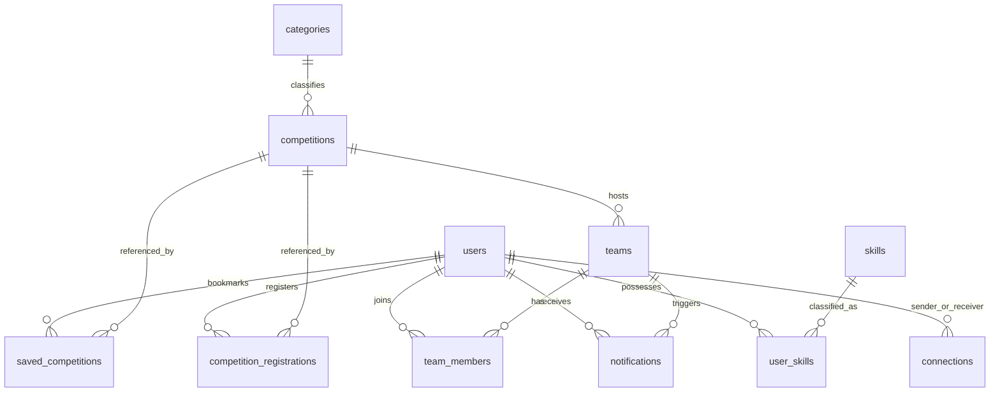
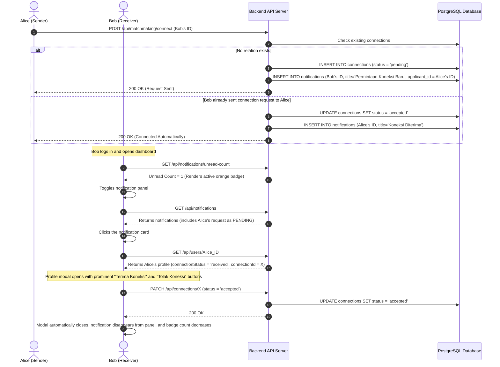

# Dokumen Persyaratan Produk (PRD): SideQuest

SideQuest adalah platform pencarian mitra kompetisi (*matchmaking*) dan rekrutmen tim kolaboratif premium yang dirancang khusus untuk mahasiswa dan penyelenggara kompetisi. Platform ini memberdayakan mahasiswa untuk menemukan kompetisi bergengsi (baik akademik maupun non-akademik), membentuk tim dengan keahlian yang saling melengkapi (*complementary skills*), serta berkolaborasi secara lancar menggunakan algoritma penjodohan bertenaga AI dan asisten chatbot SideKick interaktif.

---

## 1. Ringkasan Eksekutif & Visi

Mahasiswa sering kali mengalami kesulitan untuk menemukan rekan tim yang pas untuk kompetisi seperti hackathon, rencana bisnis (*business plan*), desain UI/UX, dan karya tulis ilmiah. Media komunikasi umum (seperti WhatsApp, Discord, atau Telegram) kurang terstruktur, tidak memfasilitasi verifikasi portofolio keahlian, dan tidak terintegrasi langsung dengan konteks kompetisi. Di sisi lain, penyelenggara lomba (*Event Organizer*) kesulitan mempromosikan event dan memverifikasi data pendaftar kelompok.

SideQuest hadir untuk menyatukan ekosistem ini dalam satu portal premium:
- **Landing Page**: Halaman utama satu halaman (one-page) terinspirasi LinkedIn dengan ilustrasi kolaborasi premium (`assets/hero.png`), tombol CTA Ganda ("Mulai sebagai Peserta 🚀", "Daftar sebagai Penyelenggara 💼"), proposisi nilai, dan statistik lomba aktif secara real-time.
- **Direktori Lomba**: Memudahkan pencarian info kompetisi yang dapat disaring berdasarkan kategori, cakupan wilayah, dan biaya pendaftaran, mendukung format partisipasi Perorangan maupun Tim.
- **AI Matchmaking Engine (Fase 2)**: Menghitung persentase kecocokan (*Compatibility Score* 60% s.d. 99%) secara cerdas berdasarkan kecocokan celah keahlian (*skill-gap*), sinergi program studi lintas fungsi (*cross-functional major synergy*), dan kesamaan almamater, disertai ulasan naratif analisis AI (`aiInsight`).
- **SideKick AI Assistant (Fase 3)**: Chatbot interaktif melayang (`⚡`) global di dasbor yang mendeteksi maksud chat pengguna (intensi pencarian lomba, rekan tim, atau FAQ) dan merendernya dalam bentuk kartu interaktif mini (Rich Cards) yang persisten menggunakan penyimpanan lokal.
- **Tata Kelola Staf (Moderator & Superadmin)**: Dasbor operasional berskema glassmorphic gelap untuk menonaktifkan pengguna/tim/lomba, scraping kompetisi luar berbasis AI, menyalakan maintenance mode seluruh situs, dan switch modul feature flags.

---

## 2. Audiens Sasaran & Persona Pengguna

| Persona | Peran | Tujuan Utama | Hambatan Utama |
| :--- | :--- | :--- | :--- |
| **Inisiator Proyek (Ketua Tim)** | Mahasiswa dengan ide/rencana tim matang | Ingin merekrut spesialis keahlian tertentu (misal: Programmer mencari UI/UX Designer atau Presenter Bisnis). | Kesulitan menyaring pendaftar berdasarkan skill terverifikasi dan mengelola kelayakan kuota anggota tim. |
| **Spesialis Solo (Pencari Tim)** | Mahasiswa bertalenta tanpa tim | Ingin ditemukan oleh tim-tim aktif atau mencari rekan kompeten untuk membentuk tim baru. | Sulit menemukan tim terpercaya yang memiliki keselarasan target kompetisi dan keahlian yang komplementer. |
| **Penyelenggara Kompetisi (EO)** | Asosiasi mahasiswa, kepanitiaan, atau institusi luar | Mempublikasikan kompetisi mandiri secara terpadu, mengumpulkan berkas pendaftaran, serta menyebarkan pengumuman massal. | Data pendaftaran tersebar, sulit memvalidasi jumlah anggota tim pendaftar, dan kurangnya kanal khusus mahasiswa berprestasi. |
| **Staf Platform (Moderator & Superadmin)** | Operator & Pengembang SideQuest | Menjaga keamanan data, melakukan penangguhan akun melanggar, scrape lomba, dan memantau status pemeliharaan platform. | Membutuhkan kendali cepat atas penangguhan massal, pengimporan lomba cepat, dan toggle modul fitur platform. |

---

## 3. Spesifikasi Fitur Utama

### 3.1. Autentikasi & Keamanan
- **Pendaftaran Peran Ganda (Multi-Role Signup)**: Sakelar tombol tab pada form registrasi:
  - *Peserta Lomba*: Mengisi universitas, program studi, dan tingkat semester.
  - *Penyelenggara Lomba*: Menyembunyikan isian mahasiswa dan menampilkan input *"Nama Instansi Penyelenggara"*, menyimpan role sebagai `organizer`, dan langsung mengarahkan ke dasbor EO saat sukses.
- **Layar Pemulihan Sandi (Forgot Password)**: Verifikasi email terhubung ke database. Email terdaftar menampilkan banner kaca buram (glassmorphism) hijau sukses mengirim instruksi; email salah menampilkan eror merah `404 Not Found` yang informatif.
- **Keamanan Token JWT**: Autentikasi JWT stateless dengan token penyegaran (*refresh token*), melarang login bagi akun yang ditangguhkan (`is_active = false`) dengan pesan suspensi khusus (`403 Forbidden`).

### 3.2. Direktori & Detail Lomba
- **Saringan Fleksibel**: Cari kompetisi berdasarkan kategori, wilayah, gratis/bayar, dan tenggat pendaftaran terdekat.
- **Format Partisipasi Kelompok**: Mendukung pembatasan jumlah **minimum** dan **maximum** anggota tim pendaftar secara ketat untuk kepatuhan administrasi.
- **Metode Publikasi EO**:
  - *Hosted (Terpadu)*: Form pendaftaran dibangun di SideQuest, membuka menu validasi kuota tim instan, pengumpulan berkas, dan pengumuman dasbor.
  - *Non-Hosted (Eksternal)*: Halaman info lomba biasa di mana tombol registrasi mengalihkan pengguna ke tautan luar (seperti Google Forms/situs eksternal).

### 3.3. AI Partner Matchmaking (Fase 2)
- **Mesin Skoring AI Multi-Dimensi**: Skor kecocokan (60% s.d. 99%) dihitung logis berdasarkan:
  - *Skor Dasar*: 50 poin.
  - *Skill-Gap Analysis (Maks +20)*: Mendeteksi skill kandidat yang belum dikuasai oleh user login (kandidat melengkapi keahlian user).
  - *Cross-Functional Major Synergy (Maks +15)*: Pengelompokan ranah studi (Tech, Design, Business, Science, Social). Kombinasi silang (seperti Tech + Design) mendapat +15 poin; ranah sejenis mendapat +5 poin.
  - *Keselarasan Minat Lomba (Maks +8)*: Kesamaan kategori kompetisi yang disukai.
  - *Almamater Kampus (Maks +5)*: Bonus satu universitas.
- **AI Dynamic Reasoning Generator**: Menyusun penjelasan naratif `aiInsight` personal yang menjelaskan ranah sinergi dan alasan mengapa kandidat tersebut direkomendasikan.
- **UI Capsule Highlight**: Menyematkan tag visual ungu berkilau (`✨ Sinergi`), disclaimer AI khusus (`⚡ Generated by SideQuest AI`), dan chips skill pelengkap berlabel *"Mengisi Celah"*.

### 3.4. Hub Rekrutmen Tim
- **Bentuk Tim**: Pemilik tim menentukan deskripsi rekrutmen, kuota maksimal, kontak, lomba target, dan tag skill yang dicari.
- **ATS Rekrutmen**: Pemilik dapat meninjau data portfolio pelamar secara real-time, mengklik tombol "Setuju Bergabung" atau "Tolak" secara asinkron.

### 3.5. Mesin Notifikasi Premium Real-Time
- **Pembaruan Lencana (Badge Count)**: Menghitung total notifikasi belum terbaca, ajakan koneksi, dan lamaran tim masuk secara asinkron.
- **Panel Dropdown Notifikasi**: Menyajikan tumpukan notifikasi dengan label kuning **PENDING** jika belum direspon.
- **Aksi Cepat via Modal**: Klik pada notifikasi langsung memunculkan modal detail profil pelamar lengkap dengan tombol aksi di bawahnya. Setelah direspon, notifikasi otomatis terhapus dari panel dan lencana notifikasi berkurang instan.

### 3.6. SideKick AI Assistant & Personal Agent (Fase 3)
- **Injeksi Dinamis Global**: Modul `import('./sidekick.js')` memuat asisten melayang secara dinamis saat sesi dimuat di `fillSidebarUser()`, memastikan chatbot tersedia di seluruh halaman dasbor tanpa mengedit file HTML manual.
- **Stateless Keyword Intent Engine (Backend)**: Menganalisis obrolan secara cerdas berdasarkan kata kunci:
  - *Lomba*: Menampilkan daftar kompetisi yang cocok.
  - *Rekan Tim*: Mencari profil mahasiswa berdasarkan skill atau nama universitas.
  - *Panduan/FAQ*: Menjawab pertanyaan umum (Matchmaking AI, biaya EO, batasan kelompok).
  - *Conversational Fallback*: Sapaan awal perkenalan SideKick.
- **Laci Percakapan Drawer (Frontend)**: Drawer chat berlayar dari kanan. Riwayat chat tersimpan di `localStorage` (`sq_sidekick_chat_history`) agar percakapan tetap tersimpan saat berpindah menu dasbor.
- **Rich Cards Interaktif**: Chat bubble SideKick merender kartu lomba mini (disertai link detail) dan kartu kandidat mini (disertai tombol "Hubungkan ✨" yang memicu pengiriman koneksi langsung dari dalam jendela obrolan).

### 3.7. Tata Kelola Platform Staf (Moderator & Superadmin)
- **Moderasi Cepat**: Slider toggle keaktifan untuk menonaktifkan akun pengguna, tim, atau kompetisi melanggar secara real-time.
- **AI Web Scraper Console**: Memungkinkan moderator menempelkan URL Instagram kompetisi luar, menyimulasikan logs scraper di terminal retro, dan menyimpan draf ke database.
- **Superadmin Panel Deck**: Fitur untuk menangguhkan moderator staf, feature flags mematikan/menghidupkan modul platform (matchmaking, tim, lomba), dan master switch **Maintenance Mode** (peserta diblokir layar pemeliharaan `maintenance.html` dengan jam pasir emas, staf melintas bypass).

---

## 4. Detail Fitur, Peta Situs (Site Map) & Hak Akses Peran

Untuk memastikan tata kelola platform yang konsisten, aman, dan berkinerja tinggi, seluruh modul fitur diatur berdasarkan struktur navigasi situs yang terintegrasi dan matriks otorisasi berbasis peran (Role-Based Access Control / RBAC) yang ketat.

### 4.1. Peta Situs (Site Map)

Berikut adalah hierarki navigasi halaman publik dan panel dasbor pengguna pada platform SideQuest:

- **Halaman Publik (Tanpa Autentikasi)**
  - Landing Page (`index.html`) -> Proposisi Nilai, Live Statistik, Daftar 5 Lomba Terakhir (Read-Only)
  - Halaman Tentang Kami (`pages/about.html`) -> Visi & Tim Developer
  - Halaman FAQ (`pages/faq.html`) -> Tanya Jawab Operasional
  - Syarat & Ketentuan (`pages/terms.html`) -> Ketentuan Layanan Ringkas
  - Kebijakan Privasi (`pages/privacy.html`) -> Kebijakan Pengelolaan Data
  - Halaman Masuk (`pages/login.html`) -> Form Masuk Utama
  - Halaman Pendaftaran (`pages/register.html`) -> Form Registrasi (Tab Peserta vs Tab Organizer)
  - Layanan Pemulihan Sandi (`pages/forgot-password.html`) -> Form Lupa Password
  - Halaman Onboarding (`pages/onboarding.html`) -> Status Verifikasi Email & Akun Baru
- **Dasbor Portal Peserta Mahasiswa (`pages/dashboard.html` & sub-menu)**
  - Dashboard Utama (`dashboard.html`) -> Statistik Diri, Ringkasan Kompetisi Aktif, Rekomendasi Partner
  - Direktori Lomba (`direktori.html`) -> List Lomba, Pencarian Cerdas, Filter Kategori/Biaya
  - Rincian Lomba (`detail.html?id=...`) -> Informasi Lomba Lengkap, Pendaftaran Tim / Gabung Rekrutmen
  - Matchmaking AI (`matchmaking.html`) -> Rekomendasi Partner Instan, Skor Kompatibilitas AI, Ulasan Sinergi AI
  - Cari Tim (`cari-tim.html`) -> ATS Lowongan Keanggotaan Tim, Pembuatan Tim Baru, Pengelolaan Pelamar Masuk
  - Profil Saya (`profil.html` & `edit-profil.html`) -> Pengelolaan Keahlian (Skills), Portofolio, Riwayat Prestasi
- **Dasbor Penyelenggara Kompetisi / EO (`pages/organizer-dashboard.html` & sub-menu)**
  - Dashboard EO (`organizer-dashboard.html`) -> Statistik Pendaftar, Kelola Kompetisi yang Dipublikasikan
  - Publikasikan Lomba (`posting-lomba.html`) -> Form Pembuatan Lomba Baru (Hosted vs Non-Hosted, Batas Anggota)
- **Dasbor Administrator / Staf (`pages/admin-dashboard.html`)**
  - Ringkasan Statistik Sistem -> Total Pengguna Aktif, Transaksi Tim, Metrik Keaktifan
  - Roster Pengawasan Pengguna -> List Moderator, Organizer, Peserta (Slider Aktif/Tangguhkan Akun)
  - Konsol AI Scraper Instagram -> Impor Data Kompetisi Otomatis via Scrape Log Retro
  - Pengendali Flags Modul & Maintenance -> Tombol On/Off Fitur Platform & Master Sakelar Maintenance Mode

### 4.2. Matriks Hak Akses Peran (Role Access Matrix)

Sistem otorisasi stateless JWT memetakan tingkat akses dari keempat peran pengguna sebagai berikut:

| Modul Fitur | Tamu / Guest | Peserta (Student) | Penyelenggara (EO) | Moderator / Superadmin |
| :--- | :---: | :---: | :---: | :---: |
| **Melihat Landing Page & FAQ** | **Lihat (Read-Only)** | **Lihat** | **Lihat** | **Lihat** |
| **Membaca Direktori Lomba** | **Lihat (Read-Only)** | **Lihat & Daftar** | **Lihat** | **Lihat & Kelola** |
| **Memposting & Edit Lomba** | Tidak Ada Akses | Tidak Ada Akses | **Penuh (Milik Sendiri)** | **Penuh (Moderasi Semua)** |
| **Rekomendasi AI Matchmaking**| Tidak Ada Akses | **Penuh (Melihat & Connect)** | Tidak Ada Akses | Tidak Ada Akses |
| **Membuat Tim & Kelola Pelamar**| Tidak Ada Akses | **Penuh (Milik Sendiri)** | Tidak Ada Akses | Tidak Ada Akses |
| **Melamar & Bergabung ke Tim**| Tidak Ada Akses | **Penuh** | Tidak Ada Akses | Tidak Ada Akses |
| **SideKick AI Assistant** | Tidak Ada Akses | **Penuh** | Tidak Ada Akses | Tidak Ada Akses |
| **Pengelolaan Portofolio Diri**| Tidak Ada Akses | **Penuh** | Tidak Ada Akses | Tidak Ada Akses |
| **Verifikasi Pendaftar Lomba**| Tidak Ada Akses | Tidak Ada Akses | **Penuh (Lomba Sendiri)** | Tidak Ada Akses |
| **Scraping Lomba AI Instagram**| Tidak Ada Akses | Tidak Ada Akses | Tidak Ada Akses | **Penuh** |
| **Tangguhkan Akun & Modul** | Tidak Ada Akses | Tidak Ada Akses | Tidak Ada Akses | **Penuh** |
| **Kelola Akun Moderator Staf**| Tidak Ada Akses | Tidak Ada Akses | Tidak Ada Akses | **Hanya Superadmin** |

---

## 5. Arsitektur Teknis & Skema Database

SideQuest didukung oleh arsitektur teknologi modern yang sangat terstruktur, andal, dan optimal, menggabungkan pengelolaan data relasional yang konsisten, pola modular frontend dinamis, serta mesin kecerdasan buatan (*deterministic AI scoring & NLP intent engines*):

### 5.1. Rincian Unit Teknologi Utama (*Core Tech Stack*)
* **Backend Utama**: Menggunakan **Node.js** dengan kerangka kerja **Express.js** yang menyajikan antarmuka RESTful API berkinerja tinggi, mengelola validasi token, mutasi status, alur notifikasi premium, serta memproses endpoint asisten AI SideKick.
* **Basis Data (Database)**: Menggunakan basis data relasional **PostgreSQL** dengan manajemen koneksi pooling (`pg` client). Skema relasional menjamin integritas transaksi data secara aman serta memfasilitasi kueri penggabungan multi-tabel (*multi-table SQL joins*) berkecepatan tinggi (seperti relasi antartim, profil mahasiswa, dan riwayat prestasi).
* **Keamanan & Autentikasi**: Dilindungi secara *stateless* menggunakan **JSON Web Tokens (JWT)**. Kata sandi dienkripsi dengan algoritma satu-arah **Bcrypt** yang kuat. Middleware pengaman memblokir akses tamu ilegal dan menghentikan login akun yang ditangguhkan (`is_active = false`) dengan status `403 Forbidden` secara instan.
* **Jembatan Komunikasi API**: Dikelola secara terpusat oleh **ESM-based client API layer (`frontend/js/api.js`)**. Modul ini membungkus semua rute panggilan API (auth, kompetisi, rekrutmen tim, koneksi matchmaking, notifikasi, sidekick) ke dalam fungsi asinkron modular. Modul ini dilengkapi dengan penangkap eror (*error interceptor*) status `401 Unauthorized` otomatis yang menyegarkan token secara senyap (*silent token refresh*) untuk menjaga kesinambungan kenyamanan sesi pengguna.

### 5.2. Penerapan Teknologi & Mesin Cerdas AI (*AI Engines*)
SideQuest menghadirkan kecerdasan buatan terpadu langsung di sisi server untuk memberikan pengalaman kolaboratif tanpa ketergantungan pada model eksternal yang lambat:
* **Mesin Skoring AI Multi-Dimensi (AI Matchmaking)**: Algoritma penilai kecocokan deterministik yang dirancang untuk mempertemukan mahasiswa dengan rekan tim komplementer secara presisi:
  - **Analisis Celah Keahlian / Skill-Gap Analysis (+20 Poin)**: Menghitung kecocokan keahlian yang dicari atau belum dikuasai oleh inisiator tim terhadap portofolio kandidat, serta menyematkan label visual *"Mengisi Celah"*.
  - **Sinergi Ranah Studi Lintas-Fungsi / Cross-Functional Domain Synergy (+15 Poin)**: Secara otomatis memetakan ratusan program studi ke dalam 5 domain fungsional (Tech, Design, Business, Science, Social). Poin penuh diberikan bagi pasangan sinergi lintas bidang (misal: Programmer + Designer) demi melahirkan formasi tim tangguh layaknya perusahaan startup.
  - **Keselarasan Minat (+8 Poin) & Almamater Kampus (+5 Poin)**: Memperhitungkan keselarasan kategori kompetisi yang disukai serta bonus kesamaan universitas asal mahasiswa.
* **Pembangun Analisis Cerdas AI (AI Dynamic Reasoning Generator)**: Secara dinamis menyusun narasi ulasan personal (`aiInsight`) pada setiap kartu kandidat, menjabarkan ranah sinergi, alasan mengapa kemitraan ini direkomendasikan, dan aspek kolaborasi potensial mereka.
* **Mesin Intensi NLP SideKick (SideKick NLP Intent Engine)**: Sistem pemrosesan bahasa alami berbasis pencocokan pola kata kunci di endpoint backend `POST /api/sidekick/chat`. Sistem ini menganalisis pesan percakapan bebas pengguna (seperti *"rekomendasikan programmer React dari IPB"*, *"cari lomba business plan"*, atau *"bagaimana cara kerja matchmaking?"*), mengidentifikasi intensi pencarian, meluncurkan SQL kueri dinamis ke PostgreSQL, serta mengembalikan data JSON terstruktur untuk dirender sebagai Rich Cards interaktif di sisi dasbor.



### 5.3. Spesifikasi Entitas (schema.sql & migrasi)

```sql
-- Informasi Akun Pengguna (termasuk is_active untuk penangguhan)
CREATE TABLE users (
  id SERIAL PRIMARY KEY,
  name VARCHAR(100) NOT NULL,
  email VARCHAR(100) UNIQUE NOT NULL,
  password VARCHAR(255) NOT NULL,
  university VARCHAR(100),
  prodi VARCHAR(100),
  avatar_color VARCHAR(20),
  bio TEXT,
  role VARCHAR(20) DEFAULT 'peserta',
  experience JSONB,
  achievements JSONB,
  online BOOLEAN DEFAULT false,
  is_active BOOLEAN DEFAULT true
);

-- Hubungan Koneksi Timbal Balik
CREATE TABLE connections (
  id SERIAL PRIMARY KEY,
  sender_id INT REFERENCES users(id) ON DELETE CASCADE,
  receiver_id INT REFERENCES users(id) ON DELETE CASCADE,
  status VARCHAR(20) DEFAULT 'pending' CHECK (status IN ('pending', 'accepted', 'rejected')),
  created_at TIMESTAMP DEFAULT CURRENT_TIMESTAMP,
  UNIQUE(sender_id, receiver_id)
);

-- Konfigurasi Platform global
CREATE TABLE platform_settings (
  key VARCHAR(100) PRIMARY KEY,
  value VARCHAR(255) NOT NULL
);
```

---

## 6. Alur Interaksi Sistem

Urutan interaksi di bawah ini menunjukkan bagaimana permintaan koneksi dimulai, diproses, dan diterima secara dinamis dari panel notifikasi dasbor.



---

## 7. Peta Jalan Produk (Roadmap) & Backlog

### Fase 1: Autentikasi & Landing Page Publik (Selesai)
- **LinkedIn-Style Landing Page**: Built split grid layout dengan Dual CTAs dan live stats.
- **Registrasi Multi-Peran & Lupa Sandi**: Penanganan form dinamis prodi/instansi dan database-backed recovery sandi.
- **Tentang Kami & FAQ**: Grid kartu profilAqilah, Fathiyya, Gilbran, dan accordion transisi tinggi yang halus.

### Fase 2: AI Matchmaking & Rekomendasi Celah Keahlian (Selesai)
- **AI Scoring Engine**: Skoring multidimensi logis prodi/skills/kampus.
- **AI UI Badge Capsule**: Desain kartu dengan disclaimer AI, tag sinergi, dan chips pelengkap keahlian.
- **E2E Validation Tests**: Penyelesaian pengujian `run_matchmaking_ai_test.js` sukses 100%.

### Fase 3: SideKick AI Assistant & Personal Agent (Selesai)
- **Global Injeksi Chatbot**: Gelembung melayang SideKick persisten dasbor dengan drawer chat.
- **Stateless Intent Engine**: Kueri asinkron database untuk mencari lomba, mahasiswa bertalenta, atau FAQ dari pesan teks.
- **Rich Cards Chat**: Kartu detail lomba dan tombol "Hubungkan" rekat dari dalam thread chat.

### Fase 4: Chat Real-Time & WebSockets (Backlog Masa Depan)
- **Komponen Instant Messaging Chat**: Membuat tabel `chat_rooms` dan `messages` di database. Mengganti toast pesan masuk dengan sidebar obrolan pesan aktif fungsional.
- **WebSocket Integration**: Memasang koneksi soket real-time untuk pengiriman pesan instan dan notifikasi desktop.
