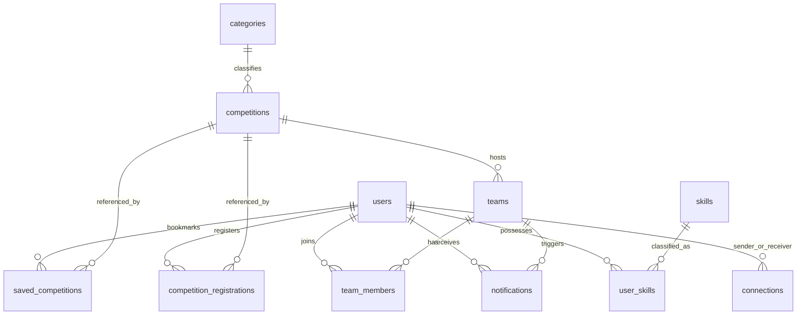
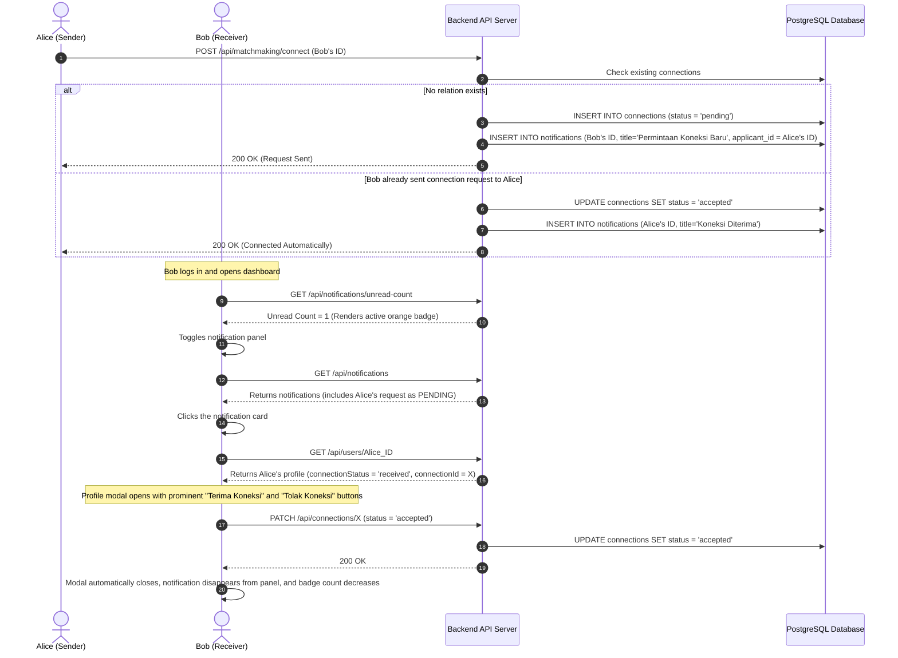

# Dokumen Persyaratan Produk (PRD): SideQuest

SideQuest adalah platform pencarian mitra kompetisi (*matchmaking*) dan rekrutmen tim kolaboratif premium yang dirancang khusus untuk mahasiswa dan penyelenggara kompetisi. Platform ini memberdayakan mahasiswa untuk menemukan kompetisi bergengsi (baik akademik maupun non-akademik), membentuk tim dengan keahlian yang saling melengkapi (*complementary skills*), serta berkolaborasi secara lancar menggunakan algoritma penjodohan bertenaga AI dan asisten chatbot SideKick interaktif.

---

## 0. Kontrol Dokumen

| Field | Nilai |
| :--- | :--- |
| **Status dokumen** | Draf untuk ditinjau |
| **Versi** | 2.0 |
| **Terakhir diperbarui** | 2026-06-03 |
| **Pemilik dokumen** | Manajemen Produk |
| **Kontributor** | Engineering, Desain, Tim pendiri |
| **Peninjau / penyetuju** | _Belum ditentukan — tetapkan sebelum sign-off_ |
| **Sumber kebenaran** | Dokumen ini divalidasi-balik terhadap kode yang berjalan (`backend/`, `frontend/`). Bila narasi dan kode berbeda, lihat §14 *Ketidaksesuaian yang Diketahui*. |

**Catatan perubahan**

| Versi | Tanggal | Penulis | Ringkasan |
| :--- | :--- | :--- | :--- |
| 1.0 | (awal) | Tim pendiri | Spesifikasi fitur/arsitektur awal (§1–§8). |
| 2.0 | 2026-06-03 | Manajemen Produk | Menambah Tujuan & Metrik Keberhasilan (§9), User Story & Kriteria Penerimaan hasil rekayasa-balik (§10), Persyaratan Non-Fungsional (§11), Asumsi/Dependensi/Batasan (§12), Risiko (§13), Ketidaksesuaian & Pertanyaan Terbuka (§14), rencana Analitik (§15), Glosarium (§16). |

> **Panduan baca.** §1–§8 adalah spesifikasi fitur dan arsitektur asli dan tetap menjadi acuan untuk *apa yang dilakukan produk*. §9–§16 ditambahkan agar dokumen memenuhi kelengkapan PRD profesional: *mengapa kita membangunnya, bagaimana mengukur keberhasilan, apa yang secara eksplisit di luar cakupan, apa yang bisa salah, dan apa yang masih belum diputuskan.*

---

## 1. Ringkasan Eksekutif & Visi

Mahasiswa sering kali mengalami kesulitan untuk menemukan rekan tim yang pas untuk kompetisi seperti hackathon, rencana bisnis (*business plan*), desain UI/UX, dan karya tulis ilmiah. Media komunikasi umum (seperti WhatsApp, Discord, atau Telegram) kurang terstruktur, tidak memfasilitasi verifikasi portofolio keahlian, dan tidak terintegrasi langsung dengan konteks kompetisi. Di sisi lain, penyelenggara lomba (*Event Organizer*) kesulitan mempromosikan event dan memverifikasi data pendaftar kelompok.

SideQuest hadir untuk menyatukan ekosistem ini dalam satu portal premium:
- **Landing Page**: Halaman utama satu halaman (one-page) terinspirasi LinkedIn dengan ilustrasi kolaborasi premium (`assets/hero.png`), tombol CTA Ganda ("Mulai sebagai Peserta 🚀", "Daftar sebagai Penyelenggara 💼"), proposisi nilai, dan statistik lomba aktif secara real-time.
- **Direktori Lomba**: Memudahkan pencarian info kompetisi yang dapat disaring berdasarkan kategori, cakupan wilayah, dan biaya pendaftaran, mendukung format partisipasi Perorangan maupun Tim.
- **AI Matchmaking Engine (Fase 2)**: Menghitung persentase kecocokan (*Compatibility Score* 60% s.d. 99%) secara cerdas berdasarkan kecocokan celah keahlian (*skill-gap*), sinergi program studi lintas fungsi (*cross-functional major synergy*), dan kesamaan almamater, disertai ulasan naratif analisis AI (`aiInsight`).
- **SideKick AI Assistant (Fase 3)**: Chatbot interaktif melayang (`⚡`) global di dasbor yang mendeteksi maksud chat pengguna (intensi pencarian lomba, rekan tim, atau FAQ) dan merendernya dalam bentuk kartu interaktif mini (Rich Cards) yang persisten menggunakan penyimpanan lokal.
- **Tata Kelola Staf (Moderator & Superadmin)**: Dasbor operasional berskema glassmorphic gelap untuk menonaktifkan pengguna/tim/lomba, scraping kompetisi luar berbasis AI, menyalakan maintenance mode seluruh situs, dan switch modul feature flags.

---

## 2. Audiens Sasaran & Persona Pengguna

| Persona | Peran | Tujuan Utama | Hambatan Utama |
| :--- | :--- | :--- | :--- |
| **Inisiator Proyek (Ketua Tim)** | Mahasiswa dengan ide/rencana tim matang | Ingin merekrut spesialis keahlian tertentu (misal: Programmer mencari UI/UX Designer atau Presenter Bisnis). | Kesulitan menyaring pendaftar berdasarkan skill terverifikasi dan mengelola kelayakan kuota anggota tim. |
| **Spesialis Solo (Pencari Tim)** | Mahasiswa bertalenta tanpa tim | Ingin ditemukan oleh tim-tim aktif atau mencari rekan kompeten untuk membentuk tim baru. | Sulit menemukan tim terpercaya yang memiliki keselarasan target kompetisi dan keahlian yang komplementer. |
| **Penyelenggara Kompetisi (EO)** | Asosiasi mahasiswa, kepanitiaan, atau institusi luar | Mempublikasikan kompetisi mandiri secara terpadu, mengumpulkan berkas pendaftaran, serta menyebarkan pengumuman massal. | Data pendaftaran tersebar, sulit memvalidasi jumlah anggota tim pendaftar, dan kurangnya kanal khusus mahasiswa berprestasi. |
| **Staf Platform (Moderator & Superadmin)** | Operator & Pengembang SideQuest | Menjaga keamanan data, melakukan penangguhan akun melanggar, scrape lomba, dan memantau status pemeliharaan platform. | Membutuhkan kendali cepat atas penangguhan massal, pengimporan lomba cepat, dan toggle modul fitur platform. |

---

## 3. Spesifikasi Fitur Utama

### 3.1. Autentikasi & Keamanan
- **Pendaftaran Peran Ganda (Multi-Role Signup)**: Sakelar tombol tab pada form registrasi:
  - *Peserta Lomba*: Mengisi universitas, program studi, dan tingkat semester.
  - *Penyelenggara Lomba*: Menyembunyikan isian mahasiswa dan menampilkan input *"Nama Instansi Penyelenggara"*, menyimpan role sebagai `organizer`, dan langsung mengarahkan ke dasbor EO saat sukses.
- **Layar Pemulihan Sandi (Forgot Password)**: Verifikasi email terhubung ke database. Email terdaftar menampilkan banner kaca buram (glassmorphism) hijau sukses mengirim instruksi; email salah menampilkan eror merah `404 Not Found` yang informatif.
- **Keamanan Token JWT**: Autentikasi JWT stateless dengan token penyegaran (*refresh token*), melarang login bagi akun yang ditangguhkan (`is_active = false`) dengan pesan suspensi khusus (`403 Forbidden`).

### 3.2. Direktori & Detail Lomba
- **Saringan Fleksibel**: Cari kompetisi berdasarkan kategori, wilayah, gratis/bayar, dan tenggat pendaftaran terdekat.
- **Format Partisipasi Kelompok**: Mendukung pembatasan jumlah **minimum** dan **maximum** anggota tim pendaftar secara ketat untuk kepatuhan administrasi.
- **Metode Publikasi EO**:
  - *Hosted (Terpadu)*: Form pendaftaran dibangun di SideQuest, membuka menu validasi kuota tim instan, pengumpulan berkas, dan pengumuman dasbor.
  - *Non-Hosted (Eksternal)*: Halaman info lomba biasa di mana tombol registrasi mengalihkan pengguna ke tautan luar (seperti Google Forms/situs eksternal).

### 3.3. AI Partner Matchmaking (Fase 2)
- **Mesin Skoring AI Multi-Dimensi**: Skor kecocokan (60% s.d. 99%) dihitung logis berdasarkan:
  - *Skor Dasar*: 50 poin.
  - *Skill-Gap Analysis (Maks +20)*: Mendeteksi skill kandidat yang belum dikuasai oleh user login (kandidat melengkapi keahlian user).
  - *Cross-Functional Major Synergy (Maks +15)*: Pengelompokan ranah studi (Tech, Design, Business, Science, Social). Kombinasi silang (seperti Tech + Design) mendapat +15 poin; ranah sejenis mendapat +5 poin.
  - *Keselarasan Minat Lomba (Maks +8)*: Kesamaan kategori kompetisi yang disukai.
  - *Almamater Kampus (Maks +5)*: Bonus satu universitas.
- **AI Dynamic Reasoning Generator**: Menyusun penjelasan naratif `aiInsight` personal yang menjelaskan ranah sinergi dan alasan mengapa kandidat tersebut direkomendasikan.
- **UI Capsule Highlight**: Menyematkan tag visual ungu berkilau (`✨ Sinergi`), disclaimer AI khusus (`⚡ Generated by SideQuest AI`), dan chips skill pelengkap berlabel *"Mengisi Celah"*.

### 3.4. Hub Rekrutmen Tim
- **Bentuk Tim**: Pemilik tim menentukan deskripsi rekrutmen, kuota maksimal, kontak, lomba target, dan tag skill yang dicari.
- **ATS Rekrutmen**: Pemilik dapat meninjau data portfolio pelamar secara real-time, mengklik tombol "Setuju Bergabung" atau "Tolak" secara asinkron.

### 3.5. Mesin Notifikasi Premium Real-Time
- **Pembaruan Lencana (Badge Count)**: Menghitung total notifikasi belum terbaca, ajakan koneksi, dan lamaran tim masuk secara asinkron.
- **Panel Dropdown Notifikasi**: Menyajikan tumpukan notifikasi dengan label kuning **PENDING** jika belum direspon.
- **Aksi Cepat via Modal**: Klik pada notifikasi langsung memunculkan modal detail profil pelamar lengkap dengan tombol aksi di bawahnya. Setelah direspon, notifikasi otomatis terhapus dari panel dan lencana notifikasi berkurang instan.

### 3.6. SideKick AI Assistant & Personal Agent (Fase 3)
- **Injeksi Dinamis Global**: Modul `import('./sidekick.js')` memuat asisten melayang secara dinamis saat sesi dimuat di `fillSidebarUser()`, memastikan chatbot tersedia di seluruh halaman dasbor tanpa mengedit file HTML manual.
- **Stateless Keyword Intent Engine (Backend)**: Menganalisis obrolan secara cerdas berdasarkan kata kunci:
  - *Lomba*: Menampilkan daftar kompetisi yang cocok.
  - *Rekan Tim*: Mencari profil mahasiswa berdasarkan skill atau nama universitas.
  - *Panduan/FAQ*: Menjawab pertanyaan umum (Matchmaking AI, biaya EO, batasan kelompok).
  - *Conversational Fallback*: Sapaan awal perkenalan SideKick.
- **Laci Percakapan Drawer (Frontend)**: Drawer chat berlayar dari kanan. Riwayat chat tersimpan di `localStorage` (`sq_sidekick_chat_history`) agar percakapan tetap tersimpan saat berpindah menu dasbor.
- **Rich Cards Interaktif**: Chat bubble SideKick merender kartu lomba mini (disertai link detail) dan kartu kandidat mini (disertai tombol "Hubungkan ✨" yang memicu pengiriman koneksi langsung dari dalam jendela obrolan).

### 3.7. Tata Kelola Platform Staf (Moderator & Superadmin)
- **Moderasi Cepat**: Slider toggle keaktifan untuk menonaktifkan akun pengguna, tim, atau kompetisi melanggar secara real-time.
- **AI Web Scraper Console**: Memungkinkan moderator menempelkan URL Instagram kompetisi luar, menyimulasikan logs scraper di terminal retro, dan menyimpan draf ke database.
- **Superadmin Panel Deck**: Fitur untuk menangguhkan moderator staf, feature flags mematikan/menghidupkan modul platform (matchmaking, tim, lomba), dan master switch **Maintenance Mode** (peserta diblokir layar pemeliharaan `maintenance.html` dengan jam pasir emas, staf melintas bypass).

### 3.8. Kemitraan Sponsor & Iklan Tertarget (Fase 4)
- **Undangan Mitra Sponsor**: Moderator atau administrator dapat mengundang mitra sponsor baru secara langsung melalui menu dasbor admin. Akun langsung disahkan aktif untuk login instan.
- **Dasbor Portal Sponsor (`sponsor-dashboard.html`)**: Portal interaktif eksklusif sponsor yang menyajikan data visual lengkap:
  - **Overview Metrics**: Total investasi iklan harian, tayangan (impressions), klik aktif, dan rasio klik (CTR).
  - **Form Pembuat Iklan & Simulator Biaya**: Sponsor menentukan judul, poster/gambar, URL target, target penayangan halaman (Dashboard, Direktori Lomba, Matchmaking, atau Cari Tim), serta rentang kalender penayangan. Biaya kampanye dihitung secara dinamis dan transparan.
  - **Historical Pricing Resolving**: Tarif harga harian disimpan secara historis. Sistem secara dinamis mencari harga aktif berdasarkan tanggal mulai kampanye (`effective_date <= start_date`) demi integritas kalkulasi biaya yang adil.
  - **Audit Log Penyesuaian Biaya**: Total biaya dapat disesuaikan secara manual oleh moderator (misal: pemberian diskon khusus), namun wajib menyertakan alasan penyesuaian tertulis yang dicatat secara permanen dalam database audit log.
- **E2E Widget Banner (Mahasiswa-Facing)**:
  - Banner dinamis berestetika *glassmorphism* terpasang di 4 halaman mahasiswa.
  - Jika terdapat kampanye iklan aktif, sistem memuat iklan secara acak berimbang, mencatat tayangan secara otomatis di backend, dan melacak persentase klik (CTR) jika diakses.
  - Jika tidak ada iklan aktif, sistem secara dinamis menampilkan fallback promosi premium internal SideQuest **"Sidekick AI Assistant"**.

---

## 4. Detail Fitur, Peta Situs (Site Map) & Hak Akses Peran

Untuk memastikan tata kelola platform yang konsisten, aman, dan berkinerja tinggi, seluruh modul fitur diatur berdasarkan struktur navigasi situs yang terintegrasi dan matriks otorisasi berbasis peran (Role-Based Access Control / RBAC) yang ketat.

### 4.1. Peta Situs (Site Map)

Berikut adalah hierarki navigasi halaman publik dan panel dasbor pengguna pada platform SideQuest:

- **Halaman Publik (Tanpa Autentikasi)**
  - Landing Page (`index.html`) -> Proposisi Nilai, Live Statistik, Daftar 5 Lomba Terakhir (Read-Only)
  - Halaman Tentang Kami (`pages/about.html`) -> Visi & Tim Developer
  - Halaman FAQ (`pages/faq.html`) -> Tanya Jawab Operasional
  - Syarat & Ketentuan (`pages/terms.html`) -> Ketentuan Layanan Ringkas
  - Kebijakan Privasi (`pages/privacy.html`) -> Kebijakan Pengelolaan Data
  - Halaman Masuk (`pages/login.html`) -> Form Masuk Utama
  - Halaman Pendaftaran (`pages/register.html`) -> Form Registrasi (Tab Peserta vs Tab Organizer)
  - Layanan Pemulihan Sandi (`pages/forgot-password.html`) -> Form Lupa Password
  - Halaman Onboarding (`pages/onboarding.html`) -> Status Verifikasi Email & Akun Baru
- **Dasbor Portal Peserta Mahasiswa (`pages/dashboard.html` & sub-menu)**
  - Dashboard Utama (`dashboard.html`) -> Statistik Diri, Ringkasan Kompetisi Aktif, Rekomendasi Partner
  - Direktori Lomba (`direktori.html`) -> List Lomba, Pencarian Cerdas, Filter Kategori/Biaya
  - Rincian Lomba (`detail.html?id=...`) -> Informasi Lomba Lengkap, Pendaftaran Tim / Gabung Rekrutmen
  - Matchmaking AI (`matchmaking.html`) -> Rekomendasi Partner Instan, Skor Kompatibilitas AI, Ulasan Sinergi AI
  - Cari Tim (`cari-tim.html`) -> ATS Lowongan Keanggotaan Tim, Pembuatan Tim Baru, Pengelolaan Pelamar Masuk
  - Profil Saya (`profil.html` & `edit-profil.html`) -> Pengelolaan Keahlian (Skills), Portofolio, Riwayat Prestasi
- **Dasbor Penyelenggara Kompetisi / EO (`pages/organizer-dashboard.html` & sub-menu)**
  - Dashboard EO (`organizer-dashboard.html`) -> Statistik Pendaftar, Kelola Kompetisi yang Dipublikasikan
  - Publikasikan Lomba (`posting-lomba.html`) -> Form Pembuatan Lomba Baru (Hosted vs Non-Hosted, Batas Anggota)
- **Dasbor Mitra Sponsor / Brand (`pages/sponsor-dashboard.html` & sub-menu)**
  - Konsol Utama Sponsor (`sponsor-dashboard.html`) -> Pengelolaan Promosi Iklan Banner, Voucher Bootcamp/Alat Pengembangan, Promosi Kemitraan Kompetisi.
- **Dasbor Administrator / Staf (`pages/admin-dashboard.html`)**
  - Ringkasan Statistik Sistem -> Total Pengguna Aktif, Transaksi Tim, Metrik Keaktifan, Roster Sponsor Aktif
  - Roster Pengawasan Pengguna -> List Moderator, Organizer, Sponsor, Peserta (Slider Aktif/Tangguhkan Akun)
  - Konsol AI Scraper Instagram -> Impor Data Kompetisi Otomatis via Scrape Log Retro
  - Pengendali Flags Modul & Maintenance -> Tombol On/Off Fitur Platform & Master Sakelar Maintenance Mode

### 4.2. Matriks Hak Akses Peran (Role Access Matrix)

Sistem otorisasi stateless JWT memetakan tingkat akses dari kelima peran pengguna sebagai berikut:

| Modul Fitur | Tamu / Guest | Peserta (Student) | Penyelenggara (EO) | Mitra Sponsor | Moderator / Superadmin |
| :--- | :---: | :---: | :---: | :---: | :---: |
| **Melihat Landing Page & FAQ** | **Lihat (Read-Only)** | **Lihat** | **Lihat** | **Lihat** | **Lihat** |
| **Membaca Direktori Lomba** | **Lihat (Read-Only)** | **Lihat & Daftar** | **Lihat** | **Lihat** | **Lihat & Kelola** |
| **Memposting & Edit Lomba** | Tidak Ada Akses | Tidak Ada Akses | **Penuh (Milik Sendiri)** | Tidak Ada Akses | **Penuh (Moderasi Semua)** |
| **Rekomendasi AI Matchmaking**| Tidak Ada Akses | **Penuh (Melihat & Connect)** | Tidak Ada Akses | Tidak Ada Akses | Tidak Ada Akses |
| **Membuat Tim & Kelola Pelamar**| Tidak Ada Akses | **Penuh (Milik Sendiri)** | Tidak Ada Akses | Tidak Ada Akses | Tidak Ada Akses |
| **Melamar & Bergabung ke Tim**| Tidak Ada Akses | **Penuh** | Tidak Ada Akses | Tidak Ada Akses | Tidak Ada Akses |
| **SideKick AI Assistant** | Tidak Ada Akses | **Penuh** | Tidak Ada Akses | Tidak Ada Akses | Tidak Ada Akses |
| **Pengelolaan Portofolio Diri**| Tidak Ada Akses | **Penuh** | Tidak Ada Akses | Tidak Ada Akses | Tidak Ada Akses |
| **Verifikasi Pendaftar Lomba**| Tidak Ada Akses | Tidak Ada Akses | **Penuh (Lomba Sendiri)** | Tidak Ada Akses | Tidak Ada Akses |
| **Kelola Kampanye & Iklan**| Tidak Ada Akses | Tidak Ada Akses | Tidak Ada Akses | **Penuh (Milik Sendiri)** | **Penuh (Moderasi Semua)** |
| **Scraping Lomba AI Instagram**| Tidak Ada Akses | Tidak Ada Akses | Tidak Ada Akses | Tidak Ada Akses | **Penuh** |
| **Tangguhkan Akun & Modul** | Tidak Ada Akses | Tidak Ada Akses | Tidak Ada Akses | Tidak Ada Akses | **Penuh** |
| **Kelola Akun Moderator Staf**| Tidak Ada Akses | Tidak Ada Akses | Tidak Ada Akses | Tidak Ada Akses | **Hanya Superadmin** |

---

## 5. Arsitektur Teknis & Skema Database

SideQuest didukung oleh arsitektur teknologi modern yang sangat terstruktur, andal, dan optimal, menggabungkan pengelolaan data relasional yang konsisten, pola modular frontend dinamis, serta mesin kecerdasan buatan (*deterministic AI scoring & NLP intent engines*):

### 5.1. Rincian Unit Teknologi Utama (*Core Tech Stack*)
* **Backend Utama**: Menggunakan **Node.js** dengan kerangka kerja **Express.js** yang menyajikan antarmuka RESTful API berkinerja tinggi, mengelola validasi token, mutasi status, alur notifikasi premium, serta memproses endpoint asisten AI SideKick.
* **Basis Data (Database)**: Menggunakan basis data relasional **PostgreSQL** dengan manajemen koneksi pooling (`pg` client). Skema relasional menjamin integritas transaksi data secara aman serta memfasilitasi kueri penggabungan multi-tabel (*multi-table SQL joins*) berkecepatan tinggi (seperti relasi antartim, profil mahasiswa, dan riwayat prestasi).
* **Keamanan & Autentikasi**: Dilindungi secara *stateless* menggunakan **JSON Web Tokens (JWT)**. Kata sandi dienkripsi dengan algoritma satu-arah **Bcrypt** yang kuat. Middleware pengaman memblokir akses tamu ilegal dan menghentikan login akun yang ditangguhkan (`is_active = false`) dengan status `403 Forbidden` secara instan.
* **Jembatan Komunikasi API**: Dikelola secara terpusat oleh **ESM-based client API layer (`frontend/js/api.js`)**. Modul ini membungkus semua rute panggilan API (auth, kompetisi, rekrutmen tim, koneksi matchmaking, notifikasi, sidekick) ke dalam fungsi asinkron modular. Modul ini dilengkapi dengan penangkap eror (*error interceptor*) status `401 Unauthorized` otomatis yang menyegarkan token secara senyap (*silent token refresh*) untuk menjaga kesinambungan kenyamanan sesi pengguna.

### 5.2. Penerapan Teknologi & Mesin Cerdas AI (*AI Engines*)
SideQuest menghadirkan kecerdasan buatan terpadu langsung di sisi server untuk memberikan pengalaman kolaboratif tanpa ketergantungan pada model eksternal yang lambat:
* **Mesin Skoring AI Multi-Dimensi (AI Matchmaking)**: Algoritma penilai kecocokan deterministik yang dirancang untuk mempertemukan mahasiswa dengan rekan tim komplementer secara presisi:
  - **Analisis Celah Keahlian / Skill-Gap Analysis (+20 Poin)**: Menghitung kecocokan keahlian yang dicari atau belum dikuasai oleh inisiator tim terhadap portofolio kandidat, serta menyematkan label visual *"Mengisi Celah"*.
  - **Sinergi Ranah Studi Lintas-Fungsi / Cross-Functional Domain Synergy (+15 Poin)**: Secara otomatis memetakan ratusan program studi ke dalam 5 domain fungsional (Tech, Design, Business, Science, Social). Poin penuh diberikan bagi pasangan sinergi lintas bidang (misal: Programmer + Designer) demi melahirkan formasi tim tangguh layaknya perusahaan startup.
  - **Keselarasan Minat (+8 Poin) & Almamater Kampus (+5 Poin)**: Memperhitungkan keselarasan kategori kompetisi yang disukai serta bonus kesamaan universitas asal mahasiswa.
* **Pembangun Analisis Cerdas AI (AI Dynamic Reasoning Generator)**: Secara dinamis menyusun narasi ulasan personal (`aiInsight`) pada setiap kartu kandidat, menjabarkan ranah sinergi, alasan mengapa kemitraan ini direkomendasikan, dan aspek kolaborasi potensial mereka.
* **Mesin Intensi NLP SideKick (SideKick NLP Intent Engine)**: Sistem pemrosesan bahasa alami berbasis pencocokan pola kata kunci di endpoint backend `POST /api/sidekick/chat`. Sistem ini menganalisis pesan percakapan bebas pengguna (seperti *"rekomendasikan programmer React dari IPB"*, *"cari lomba business plan"*, atau *"bagaimana cara kerja matchmaking?"*), mengidentifikasi intensi pencarian, meluncurkan SQL kueri dinamis ke PostgreSQL, serta mengembalikan data JSON terstruktur untuk dirender sebagai Rich Cards interaktif di sisi dasbor.



### 5.3. Spesifikasi Entitas (schema.sql & migrasi)

```sql
-- Informasi Akun Pengguna (termasuk is_active untuk penangguhan)
CREATE TABLE users (
  id SERIAL PRIMARY KEY,
  name VARCHAR(100) NOT NULL,
  email VARCHAR(100) UNIQUE NOT NULL,
  password VARCHAR(255) NOT NULL,
  university VARCHAR(100),
  prodi VARCHAR(100),
  avatar_color VARCHAR(20),
  bio TEXT,
  role VARCHAR(20) DEFAULT 'peserta',
  experience JSONB,
  achievements JSONB,
  online BOOLEAN DEFAULT false,
  is_active BOOLEAN DEFAULT true
);

-- Hubungan Koneksi Timbal Balik
CREATE TABLE connections (
  id SERIAL PRIMARY KEY,
  sender_id INT REFERENCES users(id) ON DELETE CASCADE,
  receiver_id INT REFERENCES users(id) ON DELETE CASCADE,
  status VARCHAR(20) DEFAULT 'pending' CHECK (status IN ('pending', 'accepted', 'rejected')),
  created_at TIMESTAMP DEFAULT CURRENT_TIMESTAMP,
  UNIQUE(sender_id, receiver_id)
);

-- Konfigurasi Platform global
CREATE TABLE platform_settings (
  key VARCHAR(100) PRIMARY KEY,
  value VARCHAR(255) NOT NULL
);

-- Konfigurasi Tarif Harga Iklan Historis
CREATE TABLE sponsorship_pricing_rates (
  id SERIAL PRIMARY KEY,
  page_key VARCHAR(50) NOT NULL, -- 'dashboard', 'competitions', 'matchmaking', 'teams'
  price_per_day DECIMAL(12, 2) NOT NULL,
  effective_date DATE NOT NULL,
  created_at TIMESTAMP DEFAULT CURRENT_TIMESTAMP
);

-- Kampanye Iklan Kemitraan Sponsor
CREATE TABLE sponsorships (
  id SERIAL PRIMARY KEY,
  sponsor_id INT REFERENCES users(id) ON DELETE CASCADE,
  title VARCHAR(150) NOT NULL,
  target_url TEXT NOT NULL,
  image_url TEXT NOT NULL,
  pages VARCHAR(50)[] NOT NULL, -- Array target page keys
  start_date DATE NOT NULL,
  end_date DATE NOT NULL,
  total_cost DECIMAL(12, 2) NOT NULL,
  impressions INT DEFAULT 0,
  clicks INT DEFAULT 0,
  is_active BOOLEAN DEFAULT true,
  created_at TIMESTAMP DEFAULT CURRENT_TIMESTAMP
);

-- Audit Log Penyesuaian Biaya Iklan oleh Moderator
CREATE TABLE sponsorship_cost_logs (
  id SERIAL PRIMARY KEY,
  sponsorship_id INT REFERENCES sponsorships(id) ON DELETE CASCADE,
  modified_by INT REFERENCES users(id) ON DELETE CASCADE,
  old_cost DECIMAL(12, 2) NOT NULL,
  new_cost DECIMAL(12, 2) NOT NULL,
  reason TEXT NOT NULL,
  modified_at TIMESTAMP DEFAULT CURRENT_TIMESTAMP
);
```

---

## 6. Alur Interaksi Sistem

Urutan interaksi di bawah ini menunjukkan bagaimana permintaan koneksi dimulai, diproses, dan diterima secara dinamis dari panel notifikasi dasbor.



---

## 7. Pengembangan Bisnis & Monetisasi (Business Development)

Untuk memastikan keberlanjutan operasional, pertumbuhan jangka panjang, dan kelayakan finansial SideQuest, platform ini mengintegrasikan strategi pemantauan kinerja berbasis metrik kuantitatif dan mempersiapkan fitur-fitur berbayar (*monetization gates*) yang siap diaktifkan saat pertumbuhan pengguna mencapai target tertentu.

### 7.1. Metrik Pemantauan Sistem GWA (Growth, Watch & Aware)

SideQuest menerapkan kerangka kerja metrik GWA (*Growth, Watch, and Aware*) untuk memantau kesehatan ekosistem platform secara *real-time*:

1. **Metrik Pertumbuhan (Growth Metrics)**: Indikator utama keberhasilan ekspansi, tingkat adopsi pengguna, dan keaktifan kolaborasi.
   - **Monthly Active Users (MAU) & Daily Active Users (DAU)**: Jumlah unik mahasiswa dan penyelenggara kompetisi yang aktif berinteraksi di platform.
   - **Tingkat Keberhasilan Tim (Team Formation Success Rate)**: Total tim bentukan mahasiswa yang berhasil melengkapi kuota anggotanya dan mendaftar ke kompetisi.
   - **Jumlah Kompetisi Aktif yang Dipublikasikan**: Total event yang aktif didaftarkan oleh penyelenggara (EO) resmi di direktori.
   - **Tingkat Retensi Pengguna (User Retention)**: Rasio kembalinya mahasiswa untuk mencari kompetisi/rekan baru setelah menyelesaikan turnamen sebelumnya.

2. **Metrik Pengawasan (Watch Metrics)**: Indikator operasional dan kenyamanan fitur yang harus dipantau secara berkala untuk menjaga retensi.
   - **Skor Kompatibilitas AI Rata-Rata**: Memastikan algoritma *matchmaking* memberikan rekomendasi yang akurat (menghindari skor di bawah batas wajar 60%).
   - **Rasio Konversi Rekrutmen (ATS Conversion Rate)**: Jumlah pelamar yang disetujui bergabung dibagi total pengaju lamaran keanggotaan tim.
   - **Volume Interaksi SideKick AI**: Jumlah total kueri dan persentase keberhasilan asisten *floating* SideKick AI mengembalikan *Rich Cards* yang relevan.
   - **Tingkat Suspensi & Moderasi**: Rasio penangguhan akun melanggar (`is_active = false`) oleh moderator untuk memastikan keamanan platform.

3. **Metrik Kesadaran (Aware Metrics)**: Indikator infrastruktur teknis dasar untuk mendeteksi potensi degradasi sistem.
   - **Server Latency & API Response Time**: Kecepatan server memproses respons REST API dan AI scoring.
   - **Database Connection Pool & CPU Usage**: Penggunaan sumber daya PostgreSQL di bawah beban tinggi kueri multi-table joins.
   - **Rasio Verifikasi Email**: Durasi waktu yang dibutuhkan pengguna baru dari pendaftaran hingga verifikasi token sukses.

### 7.2. Model Fitur Berbayar & Monetisasi (Monetization Gates)

SideQuest mempersiapkan pilar monetisasi premium terpadu yang dapat diaktifkan secara otomatis setelah platform melampaui ambang pertumbuhan tertentu (misalnya, mencapai target **10.000 MAU** dan **100+ Mitra Event Organizer terverifikasi**):

* **Premium Team Spotlight (Sorotan Rekrutmen Tim)**: Mahasiswa inisiator tim dapat membayar biaya mikro-transaksi untuk menyematkan (*pin*) tim rekrutmen mereka di posisi teratas halaman "Cari Tim" dengan lencana emas berkilau guna menjaring pelamar bertalenta lebih cepat.
* **Premium Organizer Analytics Deck (Analisis EO Eksklusif)**: Penyelenggara lomba dapat beralih ke akun berbayar untuk mengakses modul analitik canggih yang menyajikan data demografis pendaftar, asal universitas, sebaran *skillset*, serta talent scoring mahasiswa berprestasi.
* **SideKick AI Copilot Plus**: Fitur asisten AI berbayar untuk mahasiswa yang membantu membedah isi berkas CV/Portfolio PDF secara instan, membuat draf surat motivasi (*motivation letter*) secara otomatis sesuai konteks kompetisi, serta menyimulasikan sesi wawancara latihan.
* **Verified Talent Badge (Lencana Portofolio Terverifikasi)**: Penilaian mikro bagi mahasiswa untuk memverifikasi sertifikat juara kompetisi masa lalu mereka secara resmi di profil menggunakan peninjauan manual tim operasional, menampilkan tanda centang biru premium pada kartu *matchmaking*.
* **Targeted Brands Sponsorship (Program Kemitraan Sponsor)**: Mengaktifkan peran pengguna khusus `sponsor` untuk pihak luar (seperti vendor alat pengembangan software, penyedia komputasi cloud, penyelenggara pelatihan keahlian/bootcamp, dll.) untuk beriklan atau bermitra secara langsung:
  - *Sponsor Banner Promosi*: Menampilkan banner promosi bootcamp/pelatihan di halaman direktori kompetisi relevan.
  - *Giveaway & Discount Kampanye*: Menyebarkan kode promo diskon penggunaan *tools* pengembang (seperti lisensi perangkat lunak, cloud credits gratis) langsung ke panel tim mahasiswa aktif untuk menunjang pengerjaan lomba.
  - *Sponsorship Turnamen*: Bekerja sama dengan Event Organizer untuk mendanai lomba tertentu dan menaruh promosi brand sponsor pada laman detail lomba.

---

## 8. Peta Jalan Produk (Roadmap) & Backlog

### Fase 1: Autentikasi & Landing Page Publik (Selesai)
- **LinkedIn-Style Landing Page**: Built split grid layout dengan Dual CTAs dan live stats.
- **Registrasi Multi-Peran & Lupa Sandi**: Penanganan form dinamis prodi/instansi dan database-backed recovery sandi.
- **Tentang Kami & FAQ**: Grid kartu profil Aqilah, Fathiyya, Gilbran, dan accordion transisi tinggi yang halus.

### Fase 2: AI Matchmaking & Rekomendasi Celah Keahlian (Selesai)
- **AI Scoring Engine**: Skoring multidimensi logis prodi/skills/kampus.
- **AI UI Badge Capsule**: Desain kartu dengan disclaimer AI, tag sinergi, dan chips pelengkap keahlian.
- **E2E Validation Tests**: Penyelesaian pengujian `run_matchmaking_ai_test.js` sukses 100%.

### Fase 3: SideKick AI Assistant & Personal Agent (Selesai)
- **Global Injeksi Chatbot**: Gelembung melayang SideKick persisten dasbor dengan drawer chat.
- **Stateless Intent Engine**: Kueri asinkron database untuk mencari lomba, mahasiswa bertalenta, atau FAQ dari pesan teks.
- **Rich Cards Chat**: Kartu detail lomba dan tombol "Hubungkan" rekat dari dalam thread chat.

### Fase 4: Pengembangan Bisnis & Monetisasi (Selesai)
- **Dasbor KPI GWA**: Implementasi statistik pemantauan Growth, Watch, dan Aware di panel superadmin.
- **Kemitraan Sponsor & Iklan (Sponsorship)**: Integrasi penuh dasbor sponsor premium (`sponsor-dashboard.html`), formulir pembuat ad kampanye, visual simulator biaya historis date-effective asinkron, log penyesuaian biaya, dan dashboard moderasi admin.
- **E2E Widget Banner Iklan Tertarget**: Pemasangan banner glassmorphism di 4 halaman mahasiswa dengan impressions & clicks analytics tracking dan fallback cerdas ke Sidekick AI assistant.
- **E2E Integration Tests**: Pengujian komprehensif `run_sponsor_test.js` lulus sukses 100%.

### Fase 5: Chat Real-Time & WebSockets (Backlog Masa Depan)
- **Komponen Instant Messaging Chat**: Membuat tabel `chat_rooms` dan `messages` di database. Mengganti toast pesan masuk dengan sidebar obrolan pesan aktif fungsional.
- **WebSocket Integration**: Memasang koneksi soket real-time untuk pengiriman pesan instan dan notifikasi desktop.

---

## 9. Tujuan, Non-Tujuan & Metrik Keberhasilan

### 9.1. Sasaran Bisnis

SideQuest hadir untuk menjadi lapisan infrastruktur baku bagi pembentukan tim kompetisi mahasiswa di Indonesia. Sasaran produk, menurut prioritas:

1. **Likuiditas** — Membangun pasar dua sisi yang cukup padat sehingga setiap mahasiswa yang mencari rekan menemukan kecocokan yang relevan dan responsif. Ini sasaran eksistensial; sisanya sekunder.
2. **Kepercayaan** — Membuat sinyal keahlian, portofolio, dan identitas cukup andal sehingga mahasiswa yakin bertim dengan orang asing.
3. **Adopsi penyelenggara** — Menjadi kanal pilihan Penyelenggara untuk mempublikasikan dan mengelola kompetisi, menciptakan gravitasi sisi-permintaan yang menarik mahasiswa.
4. **Kesiapan monetisasi** — Menyiapkan rel premium, sponsor, dan analitik *sebelum* dibutuhkan, sehingga pendapatan bisa diaktifkan begitu ambang pertumbuhan tercapai (lihat §7.2), bukan dibangun reaktif.

### 9.2. Tujuan (dalam cakupan produk saat ini)

- Loop menyeluruh yang berfungsi: **temukan kompetisi → cari/bentuk tim → terhubung → daftar**.
- Matchmaking AI yang deterministik dan dapat dijelaskan (tanpa dependensi LLM eksternal, tanpa biaya per-panggilan).
- Platform berbasis peran penuh untuk lima peran: Mahasiswa, Penyelenggara, Sponsor, Moderator, Superadmin.
- Perkakas tata kelola operasional (ban, *feature flag*, mode pemeliharaan) agar platform dapat dijalankan dengan aman oleh tim kecil.
- Modul premium/sponsor dibangun dan dorman, dikunci di balik ambang pertumbuhan.

### 9.3. Non-Tujuan (eksplisit di luar cakupan — beserta alasannya)

| Non-Tujuan | Alasan |
| :--- | :--- |
| **Chat / pesan real-time** | Ditunda ke Fase 5. Saat ini koneksi dialihkan ke tautan kontak eksternal. Membangun chat WebSocket yang andal adalah proyek tersendiri dan tidak diperlukan untuk memvalidasi loop inti. |
| **Aplikasi mobile native (iOS/Android)** | Produk adalah web responsif. Native belum beralasan sebelum *product-market fit* web terbukti. |
| **Pemrosesan pembayaran nyata** | Modul monetisasi (§7.2) mensimulasikan perhitungan biaya; belum ada gateway pembayaran. |
| **Pengiriman email/SMS nyata** | Verifikasi email *disimulasikan* (token dicetak ke konsol server). Email transaksional nyata adalah *fast-follow*, bukan penghambat loop inti. |
| **Matchmaking / chat berbasis LLM generatif** | Mesin matchmaking dan SideKick sengaja deterministik/berbasis kata kunci — terprediksi, gratis dijalankan, mudah di-debug. |
| **Scraping media sosial nyata & otomatis** | "AI Web Scraper" adalah *simulasi* produktivitas penyelenggara yang mengisi draf kompetisi; tidak benar-benar merayapi Instagram. |
| **Multi-negara / multi-bahasa di luar ID + EN** | Produk dibangun untuk kampus Indonesia lebih dulu. |

### 9.4. Metrik Keberhasilan & Target

Kerangka GWA (§7.1) menyebut metrik yang tepat tetapi tanpa target. Tabel berikut mengusulkan **target fase-peluncuran** agar kerangka dapat ditindaklanjuti — rekomendasi PM untuk dua kuartal pertama, perlu diratifikasi tim pendiri.

| Tingkat | Metrik | Definisi | Target usulan (2 kuartal pertama) | Terinstrumentasi? |
| :--- | :--- | :--- | :--- | :---: |
| **North Star** | **Pembentukan Tim Berhasil** | Tim unik yang mencapai `min_members` dan mendaftar kompetisi | 250 | ⚠️ Bisa diturunkan dari `team_members` + `competition_registrations`; belum disurfacing |
| Growth | MAU / DAU | Pengguna aktif unik dalam jendela 30/1 hari | 2.000 MAU / rasio DAU-MAU ≥ 20% | ❌ Belum ada pelacakan event |
| Growth | Tingkat Keberhasilan Tim | % tim yang melengkapi roster & mendaftar | ≥ 35% | ⚠️ Bisa diturunkan |
| Growth | Listing Kompetisi Aktif | Kompetisi `is_active=true` dengan deadline ke depan | ≥ 60 aktif | ✅ Dapat di-query |
| Growth | Aktivasi penyelenggara | Penyelenggara yang mem-publish ≥ 1 kompetisi / total disetujui | ≥ 50% | ⚠️ Bisa diturunkan |
| Watch | Rerata Skor Matchmaking | Rerata kompatibilitas kartu yang ditampilkan | ≥ 75% (batas bawah 60%) | ⚠️ Dihitung per-permintaan, tidak dicatat |
| Watch | Tingkat penerimaan koneksi | accepted / (accepted+rejected+pending) di `connections` | ≥ 40% | ⚠️ Bisa diturunkan |
| Watch | Tingkat persetujuan ATS | pelamar disetujui / total lamaran | ≥ 30% | ⚠️ Bisa diturunkan |
| Watch | Volume & resolusi SideKick | Query/hari & % yang mengembalikan rich card vs fallback | Lacak sejak hari-1 | ❌ Belum dicatat |
| Aware | Latensi API p95 | Waktu respons persentil-95 | < 500 ms (non-AI), < 1 d (matchmaking) | ❌ Belum diukur |
| Aware | Uptime | Ketersediaan backend | ≥ 99,5% | ❌ Belum ada monitoring |
| Aware | Penyelesaian verifikasi email | % pendaftar yang verifikasi | ≥ 70% | ⚠️ `is_verified` bisa diturunkan |

> **Catatan PM.** Pola berulang "⚠️ bisa diturunkan, belum disurfacing" adalah celah analitik terbesar: data ada di PostgreSQL tetapi tidak ada yang mengagregasi atau memvisualisasikannya dari waktu ke waktu. Lihat §15. Sampai itu ada, setiap target di atas tak terverifikasi di produksi.

---

## 10. User Story & Kriteria Penerimaan

> Story ini **direkayasa-balik dari endpoint dan controller yang terimplementasi** (`backend/routes/*`, `backend/controllers/*`) dan halaman frontend (`frontend/pages/*`), sehingga menggambarkan perilaku yang *benar-benar ditunjukkan sistem hari ini*. Format: `Sebagai [peran], saya ingin [kemampuan], agar [hasil]`, diikuti kriteria Given/When/Then. Prioritas: **P0** = loop inti, **P1** = penting, **P2** = pendukung.

### Epik A — Autentikasi & Onboarding

**A1 (P0) — Daftar sebagai mahasiswa atau penyelenggara.** *Sebagai calon pengguna, saya ingin mendaftar dengan peran yang tepat, agar masuk ke pengalaman yang sesuai.* (`POST /api/auth/register`)
- Tab Mahasiswa membuat user `peserta`; tab Penyelenggara membuat user `organizer` dengan `is_approved=false` (menunggu tinjauan staf) di produksi.
- Registrasi dari `localhost` otomatis menyetel `is_verified` & `is_approved` = `true` (kemudahan pengembangan).
- Di produksi, `verification_token` dibuat dan tautan verifikasi dipancarkan (kini ke konsol server sebagai email simulasi).
- **Edge:** email duplikat ditolak; password hanya disimpan sebagai hash bcrypt, tidak pernah teks polos.

**A2 (P0) — Verifikasi email sebelum login pertama.** (`GET /api/auth/verify?token=…`)
- Akun belum terverifikasi yang mencoba login menerima `403` *"Silakan verifikasi email Anda terlebih dahulu."*
- Token valid menyetel `is_verified=true` dan menghapus token.

**A3 (P0) — Login dengan penjagaan benar.** (`POST /api/auth/login`)
- JWT (`expiresIn: 1d`) hanya diberikan ketika akun lolos berurutan: `is_active`, `is_approved`, `is_verified`, lalu kecocokan password bcrypt. Tiap kegagalan memberi pesan berbeda sesuai peran.

**A4 (P1) — Pulihkan password.** (`POST /api/auth/forgot-password`) — email dikenal menampilkan konfirmasi sukses; email tak dikenal menampilkan error berbeda.

**A5 (P1) — Setujui penyelenggara tertunda (staf).** (`PATCH /api/admin/approve-organizer/:id`) — organizer `is_approved=false` menjadi dapat login.

### Epik B — Penemuan & Pendaftaran Kompetisi

**B1 (P0) — Telusuri & saring kompetisi.** (`GET /api/competitions`, publik) — saring kategori/cakupan/biaya, urut deadline terdekat; `daysLeft` tersedia; listing kedaluwarsa/nonaktif disembunyikan.
**B2 (P0) — Lihat detail kompetisi.** (`GET /api/competitions/:id`) — menampilkan `min_members`/`max_members`, model hosted vs eksternal.
**B3 (P1) — Simpan kompetisi.** (`POST`/`DELETE /api/competitions/:id/save`, `GET /saved`).
**B4 (P0) — Daftar kompetisi.** (`POST /api/competitions/:id/register`) — status dapat di-query; tak bisa daftar ganda.
**B5 (P1) — Publikasi & kelola kompetisi (penyelenggara).** (`/organizer/create`, `PUT /organizer/:id`, `publish`, `announce`, `/organizer/mine`) — hanya pemilik/staf yang boleh mengubah; kuota anggota ditegakkan.
**B6 (P1) — Tinjau roster (penyelenggara).** (`GET /organizer/:id/applicants`, `PATCH /organizer/:id/applicants/:userId`).

### Epik C — Matchmaking AI & Koneksi

**C1 (P0) — Saran rekan berperingkat & dijelaskan.** (`GET /api/matchmaking`)
- **Penerimaan (divalidasi terhadap `matchmakingController.js`):** skor mulai **50**; **+20** bila kandidat mengisi celah keahlian (atau +10 parsial); **+15** sinergi lintas-domain (atau +5 sedomain); **+8** minat kategori sama; **+5** universitas sama; skor akhir **dibatasi 60–99**.
- Tiap kartu mengembalikan `aiInsight`, disclaimer `⚡ Generated by SideQuest AI`, dan chip *"Mengisi Celah"*; status koneksi tercermin.

**C2 (P0) — Kirim & auto-balas permintaan koneksi.** (`POST /api/matchmaking/connect`)
- Tanpa relasi sebelumnya → koneksi `pending` + notifikasi ke penerima. Bila penerima telah lebih dulu mengirim ke saya → **otomatis diterima**. `UNIQUE(sender_id, receiver_id)` mencegah duplikat.

**C3 (P0) — Respons koneksi dari notifikasi.** (`PATCH /api/connections/:id`) — status diperbarui, notifikasi hilang, badge berkurang.

### Epik D — Rekrutmen Tim (ATS)

**D1 (P0) — Buat tim perekrut.** (`POST /api/teams`) — deskripsi, maks anggota, kompetisi target, tautan kontak, keahlian dibutuhkan.
**D2 (P0) — Lamar ke tim.** (`POST /api/teams/:id/apply`).
**D3 (P0) — Setujui/tolak pelamar (ATS).** (`POST /api/teams/:id/respond`) — disetujui menambah `team_members` (peran `member`) & memberi notifikasi.
**D4 (P1) — Undang kandidat langsung.** (`POST /:id/invite`, `POST /:id/respond-invite`).
**D5 (P1) — Telusuri kandidat & tim saya.** (`GET /candidates`, `/me`, `/:id`, `PUT /:id`) — daftar publik (`GET /api/teams`) memakai *optional auth* untuk pengurutan prioritas-koneksi.

### Epik E — Notifikasi
**E1 (P0) — Badge belum-dibaca akurat.** (`GET /api/notifications/unread-count`) — menjumlah notifikasi belum dibaca, koneksi tertunda, gabungan tim.
**E2 (P0) — Tindak lanjuti notifikasi.** (`GET /api/notifications`, `PATCH /read-all`) — dropdown menampilkan item PENDING yang membuka profil/modal terkait.

### Epik F — Asisten AI SideKick
**F1 (P1) — Tanya SideKick bahasa natural.** (`POST /api/sidekick/chat`) — intent kata-kunci: cari kompetisi, cari rekan (users ⨝ skills), FAQ, atau fallback percakapan; hasil terstruktur jadi rich card; riwayat di `localStorage` (`sq_sidekick_chat_history`).

### Epik G — Profil & Portofolio
**G1 (P1) — Lihat & sunting profil.** (`GET /api/users/me`, `PUT /api/users/me`, juga di `/api/profile`) — portofolio, keahlian, pencapaian, pengalaman.

### Epik H — Suite Premium Hosted-Event (Penyelenggara)
> **Direkayasa-balik dari `premiumRoutes.js`/`premiumController.js` — jauh lebih kaya dari yang didokumentasikan §3, termasuk alur penjurian.**

**H1 (P1) — Konfigurasi event hosted.** (`GET/POST /premium/organizer/settings/:compId`, `/fields/:compId`).
**H2 (P1) — Kumpulkan & tinjau submission.** (`/organizer/submissions/:compId`; peserta: `/participant/fields/:compId`, `/participant/submit/:compId`).
**H3 (P1) — Kelola juri & penilaian.** (`GET/POST /premium/organizer/judges/:compId`).
**H4 (P1) — Portal juri.** (`/premium/judge/auth`, `/judge/submissions`, `/judge/grade`; UI `judge-portal.html`). ⚠️ **Catatan keamanan:** endpoint juri **tidak** di balik `authMiddleware` (token via query param). Lihat §13/§14.
**H5 (P1) — Analitik event.** (`GET /premium/organizer/analytics/:compId`).

### Epik I — Sponsor & Iklan Tertarget
**I1 (P1) — Buat & kelola kampanye iklan (sponsor).** (`POST /api/sponsor/ads`, `GET /ads`) — biaya dihitung dari harga efektif-tanggal.
**I2 (P1) — Tayangkan & ukur banner (sisi mahasiswa).** (`GET /active-ads`, `POST /ads/impression`, `POST /ads/:id/click`) — rotasi di 4 halaman; **fallback ke kartu promo SideKick** bila tak ada kampanye.
**I3 (P1) — Undang sponsor & audit biaya (staf).** (`/admin/invite-sponsor`, `/sponsorships`, `:id/toggle`, `:id/cost`, `/sponsorship-pricing`, `:id/logs`) — penyesuaian biaya wajib beralasan & menulis baris immutable ke `sponsorship_cost_logs`.

### Epik J — Tata Kelola Platform (Staf)
**J1 (P0) — Ban/pulihkan akun, tim, kompetisi.** (`PATCH /api/admin/toggle/:type/:id`) — membalik `is_active`; akun diban mendapat `403`.
**J2 (P1) — Scraping kompetisi tersimulasi.** (`POST /api/admin/scrape`) — mengisi draf dari URL (simulasi).
**J3 (P1) — Lihat KPI platform.** (`GET /api/admin/stats`, `/data`).
**J4 (P1) — Superadmin: toggle staf, feature flag, maintenance.** (`/super/moderator/:id/toggle`, `/super/features`, `/super/maintenance`) — flag di `platform_settings`: `feature_competitions, feature_teams, feature_matchmaking, feature_connections, feature_premium_organizer`, plus `maintenance_mode`; `maintenance_mode='true'` mengarahkan user reguler ke `maintenance.html`, staf bypass (middleware `checkPlatformStatus`).

---

## 11. Persyaratan Non-Fungsional (NFR)

> Item bertanda *aspirasional* belum terimplementasi, ditandai agar peninjau tidak menganggapnya sudah ada.

### 11.1. Performa & Skalabilitas
- **Latensi API:** p95 < 500 ms untuk CRUD/list; < 1 d untuk `GET /api/matchmaking`. *Aspirasional — belum diukur.*
- **Konkurensi:** akses PostgreSQL dipool (`pg.Pool`); ukuran pool disetel ke paket Supabase; produksi via **pooler** Supabase (port 6543).
- **Disiplin payload:** endpoint list perlu paginasi sebelum katalog melewati ~1k baris (kini tanpa paginasi — tebing skalabilitas yang diketahui).

### 11.2. Ketersediaan & Keandalan
- **Target uptime:** ≥ 99,5% untuk backend (Render) & DB (Supabase). *Belum ada monitoring/alert — disarankan.*
- **Degradasi anggun:** widget iklan sudah turun ke kartu promo saat kosong/error; pola defensif sama berlaku di mana pun data eksternal bisa kosong.

### 11.3. Keamanan & Privasi
- **AuthN:** JWT stateless (HS256), kedaluwarsa 1 hari; password bcrypt (cost 10).
- **AuthZ:** `authMiddleware`; `adminMiddleware` (`isModeratorOrAdmin`/`isSuperadmin`); akun diban (`is_active=false`) ditolak.
- **Celah yang diketahui (wajib diperbaiki sebelum skala):**
  - **Tidak ada endpoint refresh token**, padahal frontend memanggil `/api/auth/refresh` (§14). Sesi kedaluwarsa keras di 24 jam.
  - **Endpoint juri melewati `authMiddleware`** dan menerima token via query string (§10 H4).
  - `JWT_SECRET` jatuh ke string default ter-hardcode bila tak diset — produksi wajib menyetel rahasia kuat.
  - **Tanpa rate limiting** pada auth/endpoint tulis.
  - **Tanpa CSRF/pembatasan origin**; CORS terbuka lebar (`app.use(cors())`).
- **Kepatuhan:** produk melayani mahasiswa Indonesia; regime yang berlaku adalah **UU PDP (UU No. 27/2022)**, *bukan* GDPR seperti tersirat di §4.1. Kebijakan privasi & retensi/penghapusan data ditulis mengikuti UU PDP.

### 11.4. Aksesibilitas & Kualitas UX
- Target **WCAG 2.1 AA** untuk alur sisi-mahasiswa (kontras pada UI glassmorphic adalah area risiko). *Aspirasional — belum diaudit.*
- **Web responsif** satu-satunya permukaan; tetapkan matriks dukungan peramban (rekomendasi: 2 versi terbaru Chrome, Safari, Edge, Firefox; web mobile iOS/Android).

### 11.5. Internasionalisasi
- Produk **dwibahasa (Bahasa Indonesia utama, Inggris sekunder)** — PRD ini sendiri terbit dalam keduanya. Copy UI ID-dulu; perlakukan ID sebagai bahasa sumber.

### 11.6. Pemeliharaan & Operabilitas
- **Konfig:** semua rahasia via environment (`DATABASE_URL`, `JWT_SECRET`, `PORT`); `.env` di-gitignore.
- **Observabilitas:** logging terstruktur & pelacakan error *belum* ada — disarankan sebelum peluncuran publik.
- **Migrasi:** perubahan skema lewat skrip mandiri `run_*_migrations.js`. Skrip ini **tidak** berjalan otomatis saat deploy dan harus dijalankan manual terhadap produksi (jebakan operasional — lihat §13).

---

## 12. Asumsi, Dependensi & Batasan

### 12.1. Asumsi
- Mahasiswa umumnya mendaftar dengan email kampus valid (idealnya `.ac.id`); kepercayaan identitas bersandar pada ini.
- Penyelenggara bersedia memindah pengelolaan listing + roster ke SideQuest dari spreadsheet/Google Form.
- Skor deterministik "cukup baik" untuk mendorong koneksi pada skala peluncuran.
- Permintaan terkonsentrasi pada siklus kompetisi kampus Indonesia (puncak musiman).

### 12.2. Dependensi Eksternal
| Dependensi | Peran | Risiko bila gagal |
| :--- | :--- | :--- |
| **Supabase** (PostgreSQL 17) | Database produksi (pooler:6543) | Padam total — tak bisa baca/tulis |
| **Render** | Host API backend (`sidequest-backend-3930.onrender.com`) | API mati; cold start free-tier menambah latensi |
| **Vercel** | Hosting frontend (auto-deploy saat push) | Situs statis tak tersedia |
| **Paket npm** | `express, pg, jsonwebtoken, bcryptjs, cors, dotenv` (ramping) | Risiko dependensi standar |

### 12.3. Batasan
- **Tanpa belanja AI/LLM eksternal** — intelijen tetap deterministik/in-house (batasan biaya & prediktabilitas, by design).
- **Tim operasi kecil** — perkakas tata kelola harus memungkinkan segelintir staf menjalankan platform.
- **Email/pembayaran disimulasikan** — pengiriman/penagihan nyata di luar cakupan sampai ambang (§9.3).
- **Frontend tanpa framework** (ES-module vanilla JS) — mengutamakan tanpa build step & portabilitas.

---

## 13. Risiko & Mitigasi

| # | Risiko | Kemungkinan | Dampak | Mitigasi |
| :-- | :--- | :--- | :--- | :--- |
| R1 | **Cold-start / likuiditas** — pasar dua sisi tak berguna sampai kedua sisi padat. | Tinggi | Kritis | Tabur pasokan (penyelenggara + listing) dulu; fokus peluncuran 1–2 kampus untuk kepadatan lokal; data seed kaya sudah ada untuk demo. |
| R2 | **Kegagalan kepercayaan** — keahlian tak terverifikasi memungkinkan misrepresentasi. | Sedang | Tinggi | Verified Talent Badge (§7.2); tinjauan portofolio; perkakas lapor/ban (sudah ada). |
| R3 | **Celah keamanan** — tanpa rate limit, CORS terbuka, bypass auth juri, JWT secret default, endpoint refresh hilang. | Sedang | Tinggi | Jadikan "celah diketahui" §11.3 checklist pengerasan pra-peluncuran; tambah rate limit & kunci CORS ke origin dikenal. |
| R4 | **Jebakan migrasi manual** — `run_*_migrations.js` dijalankan manual ke prod. | Sedang | Tinggi | Adopsi migration runner/checklist; gerbang deploy pada status migrasi. |
| R5 | **Cold start free-tier Render** menurunkan latensi permintaan pertama. | Tinggi | Sedang | Naik ke instance hangat sebelum peluncuran/demo investor; tambah ping keep-alive. |
| R6 | **Plafon kualitas matchmaking** — skor deterministik bisa stagnan seiring pool membesar. | Sedang | Sedang | Pantau rerata skor & tingkat penerimaan (§9.4); simpan opsi swap LLM. |
| R7 | **Token GitHub & kredensial DB terekspos** di tooling/URL remote. | Sedang | Tinggi | Rotasi PAT GitHub & password Supabase; pindah ke kredensial per-pengembang & secret management. |
| R8 | **Tanpa analitik** — target §9.4 tak terverifikasi. | Tinggi | Sedang | Kirim rencana instrumentasi §15 sebelum menyatakan peluncuran. |

---

## 14. Ketidaksesuaian yang Diketahui & Pertanyaan Terbuka

### 14.1. Ketidaksesuaian Dok ↔ Kode
1. **Skema §5.3 usang.** Tabel `users` nyata memiliki jauh lebih banyak kolom (`is_verified, is_approved, verification_token, university_city, university_province, office_address, phone_number`, dst.). SQL di PRD ilustratif, bukan terkini.
2. **Suite premium kurang terdokumentasi.** Kode mengimplementasikan alur **hosted-event + custom-fields + submissions + juri + penilaian** penuh (Epik H) yang hanya disinggung di §3.
3. **Refresh token setengah-jadi.** Frontend (`api.js`) memiliki alur 401→`/api/auth/refresh`, tetapi **tidak ada route `/auth/refresh`** di backend. Bangun endpoint-nya atau hapus logika klien.
4. **Mismatch regime kepatuhan.** §4.1 menyebut "GDPR"; regime yang benar untuk pengguna Indonesia adalah **UU PDP**.
5. **Jumlah feature flag.** §3.7 mengesankan 3 toggle; ada **6** kunci di `platform_settings`.

### 14.2. Pertanyaan Terbuka (perlu pemilik keputusan)
- **OQ1:** Berapa ambang pertumbuhan nyata untuk mengaktifkan monetisasi — apakah "10rb MAU / 100 EO" di §7.2 final atau placeholder?
- **OQ2:** Apakah verifikasi email akan jadi email transaksional *nyata* sebelum peluncuran publik, atau tetap simulasi untuk kohort pertama?
- **OQ3:** Berapa harga/tier konkret untuk empat modul premium (§7.2 menyebut tanpa angka)?
- **OQ4:** Beachhead satu-kampus vs peluncuran nasional — mana yang paling menurunkan risiko cold-start (R1)?
- **OQ5:** Siapa pemilik pengerasan keamanan §11.3, dan apakah jadi gerbang peluncuran keras?

---

## 15. Rencana Analitik & Instrumentasi

GWA (§7.1, §9.4) hanya senyata pipeline datanya. Kini **belum ada pelacakan event**; metrik paling banter diturunkan via SQL ad-hoc. Rencana:

1. **Taksonomi event** — instrumentasi event loop-inti: `register`, `verify_email`, `login`, `competition_view`, `competition_register`, `matchmaking_view`, `connect_sent`, `connect_accepted`, `team_created`, `team_application`, `team_member_joined`, `sidekick_query` (dengan boolean `resolved`), `ad_impression`, `ad_click`.
2. **Definisi funnel** — funnel North Star: `register → verify → competition_view → (matchmaking_view | team_view) → connect_sent → connect_accepted → team_member_joined → competition_register`. Ukur drop-off tiap langkah.
3. **Permukaan agregasi** — kembangkan dashboard admin Superadmin (yang sudah menampilkan hitungan langsung) menjadi **dashboard GWA** yang mentren metrik §9.4 dari waktu ke waktu.
4. **Telemetri operasional** — tambah logging latensi permintaan (tingkat Aware) dan monitoring/alert uptime di Render + Supabase.
5. **Privasi** — analitik wajib menghormati UU PDP; hindari menyimpan PII di payload event; dokumentasikan retensi.

---

## 16. Glosarium

| Istilah | Makna |
| :--- | :--- |
| **GWA** | Growth · Watch · Aware — hierarki metrik tiga-tingkat pemantau kesehatan platform (§7.1). |
| **ATS** | Applicant Tracking System — alur pemilik tim meninjau & menyetujui/menolak pelamar (Epik D). |
| **SideKick** | Chatbot asisten AI deterministik dalam aplikasi (`POST /api/sidekick/chat`, Epik F). |
| **Mengisi Celah** | Chip UI yang menandai keahlian kandidat yang mengisi celah keahlian pengguna. |
| **Peserta** | Mahasiswa peserta (`role='peserta'`). |
| **Penyelenggara / EO** | Event Organizer (`role='organizer'`). |
| **Soloist / Owner** | Persona mahasiswa: soloist mencari tim; owner menjalankan tim perekrut. |
| **Hosted vs Non-Hosted** | Apakah pendaftaran kompetisi terjadi di dalam SideQuest (hosted/`terpadu`) atau dialihkan keluar (eksternal). |
| **Domain sinergi** | Salah satu 5 kelompok jurusan (Tech, Design, Business, Science, Social) untuk skor lintas-fungsi. |
| **Maintenance Mode** | Flag `platform_settings` yang mengarahkan user reguler ke `maintenance.html` sementara staf bypass. |
| **UU PDP** | UU Pelindungan Data Pribadi Indonesia (UU No. 27/2022) — regime privasi yang berlaku. |
| **North Star** | Pembentukan Tim Berhasil — metrik tunggal penangkap nilai produk terbaik (§9.4). |
